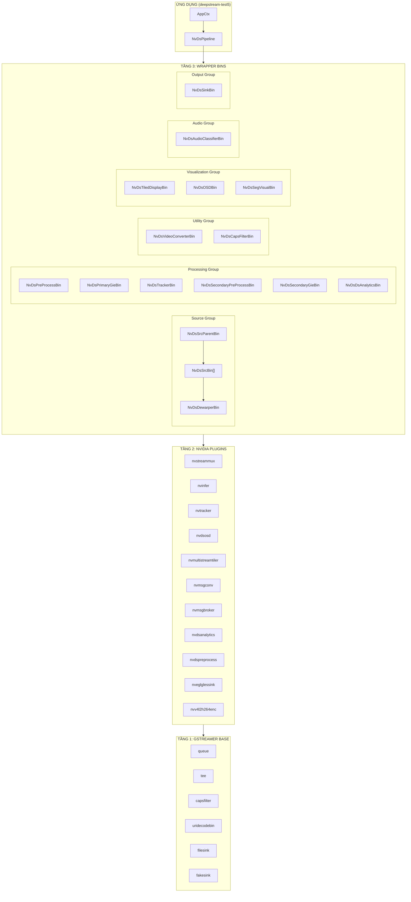

# DeepStream Elements & Bins Hierarchy

> **Mục đích**: Tài liệu này phân tầng tất cả các đối tượng trong `apps-common`, giúp phân biệt rõ ràng giữa **GStreamer Base Elements** (tầng thấp nhất), **NVIDIA Plugin Elements**, và **Application Wrapper Bins** (tầng cao nhất).

---

## 1. Tổng Quan Kiến Trúc Phân Tầng

```mermaid
flowchart TB
    subgraph L3["TẦNG 3: Application Wrapper Bins (apps-common)"]
        direction TB
        SrcParent["NvDsSrcParentBin"]
        SrcBin["NvDsSrcBin"]
        PGIEBin["NvDsPrimaryGieBin"]
        SGIEBin["NvDsSecondaryGieBin"]
        TrackerBin["NvDsTrackerBin"]
        OSDBin["NvDsOSDBin"]
        TilerBin["NvDsTiledDisplayBin"]
        SinkBin["NvDsSinkBin"]
        PreprocessBin["NvDsPreProcessBin"]
        SecPreprocessBin["NvDsSecondaryPreProcessBin"]
        AnalyticsBin["NvDsDsAnalyticsBin"]
        VideoConvBin["NvDsVideoConverterBin"]
        CapsFilterBin["NvDsCapsFilterBin"]
        AudioClassBin["NvDsAudioClassifierBin"]
    end
    
    subgraph L2["TẦNG 2: NVIDIA DeepStream Plugin Elements"]
        direction TB
        nvinfer[nvinfer]
        nvinferserver[nvinferserver]
        nvtracker[nvtracker]
        nvosd[nvdsosd]
        nvstreammux[nvstreammux]
        nvstreamdemux[nvstreamdemux]
        nvtiler[nvmultistreamtiler]
        nvmsgconv[nvmsgconv]
        nvmsgbroker[nvmsgbroker]
        nvdsanalytics[nvdsanalytics]
        nvdspreprocess[nvdspreprocess]
        nvdewarper[nvdewarper]
        nvvideoconvert[nvvideoconvert]
        nvurisrcbin[nvurisrcbin]
        nvmultiurisrcbin[nvmultiurisrcbin]
    end
    
    subgraph L1["TẦNG 1: GStreamer Base Elements"]
        direction TB
        queue[queue]
        tee[tee]
        capsfilter[capsfilter]
        uridecodebin[uridecodebin]
        decodebin[decodebin]
        fakesink[fakesink]
        filesink[filesink]
        v4l2src[v4l2src]
        rtspsrc[rtspsrc]
    end
    
    L3 --> L2
    L2 --> L1
```



---

## 2. TẦNG 1: GStreamer Base Elements

Đây là các elements cơ bản của GStreamer framework, **KHÔNG phải của NVIDIA**.

| Element | Macro | Mô tả | Khi nào dùng |
|---------|-------|-------|--------------|
| `queue` | `NVDS_ELEM_QUEUE` | Buffer giữa các elements | Luôn dùng để ngăn blocking |
| `tee` | `NVDS_ELEM_TEE` | Chia 1 stream → nhiều nhánh | Khi cần gửi data đến nhiều sinks |
| `capsfilter` | `NVDS_ELEM_CAPS_FILTER` | Đặt format input/output | Enforce format cụ thể |
| `identity` | `NVDS_ELEM_IDENTITY` | Pass-through, không xử lý | Debug hoặc probe |
| `uridecodebin` | `NVDS_ELEM_SRC_URI` | Decode từ URI (file/http) | Đọc video file |
| `decodebin` | `NVDS_ELEM_DECODEBIN` | Auto-decode any format | Decode khi không biết format trước |
| `v4l2src` | `NVDS_ELEM_SRC_CAMERA_V4L2` | Capture từ USB camera | USB/V4L2 camera input |
| `fakesink` | `NVDS_ELEM_SINK_FAKESINK` | Discard data | Test/benchmark (không output) |
| `filesink` | `NVDS_ELEM_SINK_FILE` | Ghi file | Lưu video ra file |
| `qtmux` | `NVDS_ELEM_MUX_MP4` | Container MP4 | Mux streams thành MP4 |
| `matroskamux` | `NVDS_ELEM_MKV` | Container MKV | Mux streams thành MKV |

---

## 3. TẦNG 2: NVIDIA DeepStream Plugin Elements

Đây là các **GStreamer plugins do NVIDIA viết**, có thể sử dụng trực tiếp trong pipeline.

### 3.1 Source/Decode Elements

| Element | Macro | Mô tả | Input | Output |
|---------|-------|-------|-------|--------|
| `nvarguscamerasrc` | `NVDS_ELEM_SRC_CAMERA_CSI` | CSI camera (Jetson) | CSI sensor | NV12 frames |
| `nvurisrcbin` | - | Decode + demux URI | URI string | Decoded frames |
| `nvmultiurisrcbin` | `NVDS_ELEM_NVMULTIURISRCBIN` | Multiple URI sources với REST API | URI list | Batched frames |

### 3.2 Stream Processing Elements

| Element | Macro | Mô tả | Input | Output |
|---------|-------|-------|-------|--------|
| `nvstreammux` | `NVDS_ELEM_STREAM_MUX` | **Gom frames → batch** | Nhiều streams | Batched NvBufSurface |
| `nvstreamdemux` | `NVDS_ELEM_STREAM_DEMUX` | **Tách batch → streams** | Batched frames | Từng stream riêng |
| `nvvideoconvert` | `NVDS_ELEM_VIDEO_CONV` | Color space conversion (GPU) | Any format | Target format |
| `nvdewarper` | `NVDS_ELEM_DEWARPER` | Dewarp fisheye camera | Distorted frame | Corrected frame |

### 3.3 Inference Elements

| Element | Macro | Mô tả | Input | Output |
|---------|-------|-------|-------|--------|
| `nvinfer` | `NVDS_ELEM_PGIE`, `NVDS_ELEM_SGIE` | **TensorRT inference** | Batched frames | Frames + NvDsObjectMeta |
| `nvinferserver` | `NVDS_ELEM_INFER_SERVER` | Triton Inference Server | Batched frames | Frames + NvDsObjectMeta |
| `nvinferaudio` | `NVDS_ELEM_INFER_AUDIO` | Audio inference | Audio buffers | Audio + metadata |

### 3.4 Tracking & Analytics Elements

| Element | Macro | Mô tả | Input | Output |
|---------|-------|-------|-------|--------|
| `nvtracker` | `NVDS_ELEM_TRACKER` | **Object tracking** | Frames + detections | Frames + tracking IDs |
| `nvdsanalytics` | `NVDS_ELEM_DSANALYTICS_ELEMENT` | Line crossing, ROI counting | Frames + tracked objects | Frames + analytics meta |
| `nvdspreprocess` | `NVDS_ELEM_PREPROCESS` | ROI preprocessing | Batched frames | Preprocessed tensors |

### 3.5 Visualization Elements

| Element | Macro | Mô tả | Input | Output |
|---------|-------|-------|-------|--------|
| `nvdsosd` | `NVDS_ELEM_OSD` | **Vẽ bounding boxes, text** | Frames + metadata | Annotated frames |
| `nvmultistreamtiler` | `NVDS_ELEM_TILER` | **Tiled grid display** | Batched frames | Single composite frame |
| `nvsegvisual` | `NVDS_ELEM_SEGVISUAL` | Segmentation visualization | Segmentation masks | Colored overlays |

### 3.6 Messaging Elements

| Element | Macro | Mô tả | Input | Output |
|---------|-------|-------|-------|--------|
| `nvmsgconv` | `NVDS_ELEM_MSG_CONV` | **Metadata → JSON/payload** | NvDsBatchMeta | Serialized payload |
| `nvmsgbroker` | `NVDS_ELEM_MSG_BROKER` | **Send to Kafka/MQTT/AMQP** | Payload | Network message |

### 3.7 Sink Elements

| Element | Macro | Mô tả | Platform |
|---------|-------|-------|----------|
| `nveglglessink` | `NVDS_ELEM_SINK_EGL` | OpenGL display | dGPU (x86) |
| `nv3dsink` | `NVDS_ELEM_SINK_3D` | 3D display | Jetson |
| `nvdrmvideosink` | `NVDS_ELEM_SINK_DRM` | DRM display (headless) | Both |
| `nvegltransform` | `NVDS_ELEM_EGLTRANSFORM` | EGL transform | dGPU |

### 3.8 Encoder Elements

| Element | Macro | Mô tả |
|---------|-------|-------|
| `nvv4l2h264enc` | `NVDS_ELEM_ENC_H264_HW` | H.264 hardware encoder |
| `nvv4l2h265enc` | `NVDS_ELEM_ENC_H265_HW` | H.265/HEVC hardware encoder |
| `x264enc` | `NVDS_ELEM_ENC_H264_SW` | H.264 software encoder |
| `x265enc` | `NVDS_ELEM_ENC_H265_SW` | H.265 software encoder |

---

## 4. TẦNG 3: Application Wrapper Bins

Đây là các **wrapper structures do NVIDIA tạo trong apps-common**, đóng gói nhiều elements thành 1 đơn vị logic.

> **QUAN TRỌNG**: Các Bins này **KHÔNG PHẢI GStreamer plugins**. Chúng là C structs chứa references đến nhiều elements và được tạo bằng code trong `apps-common/src/`.

### ⭐ Tại sao cần Wrapper Bins?

| Nếu dùng trực tiếp Tầng 1-2 | Khi dùng Wrapper Bin (Tầng 3) |
|-----------------------------|-------------------------------|
| Phải tự tạo từng element bằng `gst_element_factory_make()` | Một function call tạo tất cả |
| Phải tự link từng element (`gst_element_link()`) | Tự động link và ghost pads |
| Phải tự set từng property thủ công | Đọc config file và set auto |
| Phải tự quản lý error handling | Error handling tích hợp |
| Code dài, dễ sai, khó maintain | Code ngắn gọn, ít bug |
| Không có cấu trúc truy xuất | Có struct chứa reference để access sau |

### 4.1 Source Bins

#### `NvDsSrcBin` - Single Source Wrapper
**File**: [deepstream_sources.h](file:///mnt/ssd2t/Users/laptq/fs_prj26_shoplifting_detection/apps-common/includes/deepstream_sources.h)

```c
typedef struct {
  GstElement *bin;           // Container
  GstElement *src_elem;      // v4l2src / rtspsrc / filesrc
  GstElement *cap_filter;    // capsfilter
  GstElement *depay;         // rtpdepay (RTSP)
  GstElement *parser;        // h264parse / h265parse
  GstElement *decodebin;     // decodebin
  GstElement *dewarper_bin;  // NvDsDewarperBin (optional)
  // ... more elements
} NvDsSrcBin;
```

| Chức năng | Đóng gói 1 source (camera/file/RTSP) + decode |
|-----------|----------------------------------------------|
| Khi dùng | Mỗi source trong multi-source pipeline |
| Tạo bởi | `create_camera_source_bin()`, `create_uridecode_src_bin()` |
| Input | URI / device path |
| Output | Decoded frames → nvstreammux |

**🔥 Giá trị thêm so với dùng trực tiếp `uridecodebin` / `v4l2src`:**
- Tự động chọn source element phù hợp dựa trên `NvDsSourceType`
- Tích hợp sẵn `capsfilter` để enforce format
- Tự động thêm `depay` + `parser` cho RTSP streams
- Xử lý reconnection logic cho RTSP (retry khi mất kết nối)
- Tích hợp `NvDsDewarperBin` (optional) cho fisheye correction
- Callback `cb_newpad()` xử lý dynamic pads từ decodebin
- Quản lý `smart-record` để crop video theo events

---

#### `NvDsSrcParentBin` - All Sources Container
**File**: [deepstream_sources.h](file:///mnt/ssd2t/Users/laptq/fs_prj26_shoplifting_detection/apps-common/includes/deepstream_sources.h)

```c
typedef struct {
  GstElement *bin;                    // Container
  GstElement *streammux;              // nvstreammux
  NvDsSrcBin sub_bins[MAX_SOURCE_BINS];  // Array of NvDsSrcBin
  guint num_bins;
} NvDsSrcParentBin;
```

| Chức năng | Quản lý TẤT CẢ sources + streammux |
|-----------|-----------------------------------|
| Khi dùng | Multi-source pipeline |
| Tạo bởi | `create_multi_source_bin()` |
| Chứa | Nhiều NvDsSrcBin + nvstreammux |
| Output | Batched frames |

**🔥 Giá trị thêm so với dùng trực tiếp `nvstreammux`:**
- Tự động tạo và quản lý array `NvDsSrcBin[]` cho N sources
- Tự động link từng source vào sink pads `sink_0`, `sink_1`, ... của muxer
- Đồng bộ hóa việc add/remove sources động (runtime)
- Quản lý `source_id` mapping → `pad_index`
- Set muxer properties từ config (`batch-size`, `width`, `height`)
- Probe để monitor EOS từ từng source riêng biệt

---

#### ⭐ `create_nvmultiurisrcbin_bin()` vs `create_multi_source_bin()` 

**File**: [deepstream_source_bin.c](file:///mnt/ssd2t/Users/laptq/fs_prj26_shoplifting_detection/apps-common/src/deepstream_source_bin.c#L1660-L1712)

Có **2 cách** để tạo multi-source pipeline trong apps-common:

| Tiêu chí | `create_multi_source_bin()` | `create_nvmultiurisrcbin_bin()` |
|----------|----------------------------|--------------------------------|
| **Element chính** | `nvstreammux` + N × `NvDsSrcBin` | `nvmultiurisrcbin` (tích hợp muxer) |
| **Kiến trúc** | Tạo từng source bin riêng lẻ, link vào muxer | Một element duy nhất xử lý tất cả |
| **REST API** | ❌ Không có | ✅ Add/remove sources runtime via REST |
| **Dynamic sources** | ❌ Phải code thủ công | ✅ Tích hợp sẵn |
| **Khi nào dùng** | Số sources cố định, cần control chi tiết | Sources động, IOT/edge deployments |
| **Config flag** | `use_nvmultiurisrcbin = FALSE` | `use_nvmultiurisrcbin = TRUE` |

```c
// create_nvmultiurisrcbin_bin() - Đơn giản hơn nhiều
gboolean create_nvmultiurisrcbin_bin(guint num_sub_bins, 
    NvDsSourceConfig *configs, NvDsSrcParentBin *bin) {
    
    // 1. Tạo wrapper bin
    bin->bin = gst_bin_new("multiuri_src_bin");
    
    // 2. Tạo nvmultiurisrcbin (bao gồm cả muxer bên trong)
    bin->nvmultiurisrcbin = bin->streammux = 
        gst_element_factory_make(NVDS_ELEM_NVMULTIURISRCBIN, "src_nvmultiurisrcbin");
    
    // 3. Set properties (từ NvDsSourceConfig)
    set_properties_nvuribin(bin->nvmultiurisrcbin, &configs[i]);
    
    // 4. Add ghost pad
    NVGSTDS_BIN_ADD_GHOST_PAD(bin->bin, bin->streammux, "src");
    
    // Done! Chỉ cần 1 element thay vì N source bins
}
```


**Properties của `nvmultiurisrcbin`:**
- `uri-list`: Danh sách URIs (comma-separated)
- `sensor-id-list`: Danh sách sensor IDs
- `sensor-name-list`: Tên sensors (cho display)
- `max-batch-size`: Số frames tối đa trong batch
- `smart-record`: Enable smart recording
- `rtsp-reconnect-interval`: Thời gian chờ trước khi reconnect

---

#### `NvDsDewarperBin` - Dewarping Wrapper
**File**: [deepstream_dewarper.h](file:///mnt/ssd2t/Users/laptq/fs_prj26_shoplifting_detection/apps-common/includes/deepstream_dewarper.h)

```c
typedef struct {
  GstElement *bin;
  GstElement *queue;
  GstElement *nvvidconv;
  GstElement *cap_filter;
  GstElement *nvdewarper;
} NvDsDewarperBin;
```

| Chức năng | Dewarp fisheye/360 camera |
|-----------|--------------------------|
| Khi dùng | Camera có lens distortion |
| Tạo bởi | `create_dewarper_bin()` |

**🔥 Giá trị thêm so với dùng trực tiếp `nvdewarper`:**
- Tích hợp `nvvideoconvert` để đảm bảo input format đúng
- Tự động thêm `queue` để prevent blocking
- Set properties từ `NvDsDewarperConfig` (gpu-id, surfaces-per-frame)
- Ghost pads để dễ dàng link vào pipeline

---

### 4.2 Inference Bins

#### `NvDsPrimaryGieBin` - Primary Inference Wrapper
**File**: [deepstream_primary_gie.h](file:///mnt/ssd2t/Users/laptq/fs_prj26_shoplifting_detection/apps-common/includes/deepstream_primary_gie.h)

```c
typedef struct {
  GstElement *bin;
  GstElement *queue;
  GstElement *nvvidconv;     // Color conversion
  GstElement *primary_gie;   // nvinfer
} NvDsPrimaryGieBin;
```

| Chức năng | Primary object detection |
|-----------|-------------------------|
| Khi dùng | Phát hiện object (YOLO, SSD, etc.) |
| Tạo bởi | `create_primary_gie_bin()` |
| Config | `[primary-gie]` section |
| Core element | `nvinfer` |

**🔥 Giá trị thêm so với dùng trực tiếp `nvinfer`:**
- Tích hợp `nvvideoconvert` trước inference (đảm bảo input format)
- Queue để buffer và prevent blocking
- Set all properties từ config file (model-engine, batch-size, interval)
- Hỗ trợ hot-swap model (OTA update) - không cần restart pipeline
- Tự động load label file và parse thành array
- Override bbox colors từ config

---

#### `NvDsSecondaryGieBin` - Multiple Secondary Inferences
**File**: [deepstream_secondary_gie.h](file:///mnt/ssd2t/Users/laptq/fs_prj26_shoplifting_detection/apps-common/includes/deepstream_secondary_gie.h)

```c
typedef struct {
  GstElement *bin;
  GstElement *tee;           // Split to multiple SGIEs
  GstElement *queue;
  NvDsSecondaryGieBinSubBin sub_bins[MAX_SECONDARY_GIE_BINS];
} NvDsSecondaryGieBin;

typedef struct {
  GstElement *queue;
  GstElement *secondary_gie;  // nvinfer
  GstElement *tee;
  GstElement *sink;
} NvDsSecondaryGieBinSubBin;
```

| Chức năng | Classification/attribute extraction |
|-----------|-----------------------------------|
| Khi dùng | Vehicle type, color, make, etc. |
| Tạo bởi | `create_secondary_gie_bin()` |
| Config | `[secondary-gie0]`, `[secondary-gie1]`, ... |
| Core element | Multiple `nvinfer` in parallel |

**🔥 Giá trị thêm so với dùng nhiều `nvinfer` riêng lẻ:**
- Tự động tạo `tee` để split data đến nhiều SGIEs song song
- Quản lý hierarchy parent-child giữa các SGIEs (cascade inference)
- Tích hợp `nvdsmetafunnel` để merge metadata từ nhiều SGIEs
- Mutex và condition variable để đồng bộ flush operation
- Probe `wait_for_sgie_process_buf_probe_id` để sync processing
- Logic `operate-on-gie-id` và `operate-on-class-ids` để filter objects

#### `NvDsPreProcessBin` - Preprocessing Wrapper
**File**: [deepstream_preprocess.h](file:///mnt/ssd2t/Users/laptq/fs_prj26_shoplifting_detection/include/deepstream/apps-common/deepstream_preprocess.h)

```c
typedef struct {
  GstElement *bin;
  GstElement *queue;
  GstElement *preprocess;    // nvdspreprocess
} NvDsPreProcessBin;
```

| Chức năng | ROI-based preprocessing |
|-----------|------------------------|
| Khi dùng | Custom tensor prep trước inference |
| Tạo bởi | `create_preprocess_bin()` |
| Config | `[pre-process]` section |

**🔥 Giá trị thêm so với dùng trực tiếp `nvdspreprocess`:**
- Quản lý config file path và set tự động
- Queue để buffer data
- Ghost pads để dễ link vào pipeline

---

#### `NvDsSecondaryPreProcessBin` - Secondary Preprocessing Wrapper
**File**: [deepstream_secondary_preprocess.h](file:///mnt/ssd2t/Users/laptq/fs_prj26_shoplifting_detection/include/deepstream/apps-common/deepstream_secondary_preprocess.h)

```c
typedef struct {
  GstElement *queue;
  GstElement *secondary_preprocess;  // nvdspreprocess
  GstElement *tee;
  GstElement *sink;
  gboolean create;
  guint num_children;
  gint parent_index;
} NvDsSecondaryPreProcessBinSubBin;

typedef struct {
  GstElement *bin;
  GstElement *tee;
  GstElement *queue;
  gulong wait_for_secondary_preprocess_process_buf_probe_id;
  gboolean stop;
  gboolean flush;
  NvDsSecondaryPreProcessBinSubBin sub_bins[MAX_SECONDARY_GIE_BINS];
  GMutex wait_lock;
  GCond wait_cond;
} NvDsSecondaryPreProcessBin;
```

| Chức năng | Tiền xử lý cho Secondary GIE (SGIE) |
|-----------|--------------------------------------|
| Khi dùng | Custom tensor preparation trước SGIE (VD: pose-based behavior classification) |
| Tạo bởi | `create_secondary_preprocess_bin()` |
| Config | `[secondary-pre-process0]`, `[secondary-pre-process1]`, ... |
| Core element | Nhiều `nvdspreprocess` (1 per SGIE), tương tự cách `NvDsSecondaryGieBin` quản lý nhiều SGIE |

**🔥 Giá trị thêm so với dùng trực tiếp `nvdspreprocess`:**
- Quản lý nhiều secondary preprocess instances (tương tự `NvDsSecondaryGieBin`)
- Tự động tạo `tee` để split data đến nhiều preprocessor song song
- Hỗ trợ cascade (parent-child relationship via `parent_index`, `num_children`)
- Mutex + condition variable để đồng bộ flush/stop
- Probe `wait_for_secondary_preprocess_process_buf_probe_id` để sync processing

### 4.3 Tracking & Analytics Bins

#### `NvDsTrackerBin` - Tracker Wrapper
**File**: [deepstream_tracker.h](file:///mnt/ssd2t/Users/laptq/fs_prj26_shoplifting_detection/apps-common/includes/deepstream_tracker.h)

```c
typedef struct {
  GstElement *bin;
  GstElement *tracker;       // nvtracker
} NvDsTrackerBin;
```

| Chức năng | Object tracking across frames |
|-----------|------------------------------|
| Khi dùng | Gán ID duy nhất cho objects |
| Tạo bởi | `create_tracking_bin()` |
| Config | `[tracker]` section |
| Core element | `nvtracker` |

**🔥 Giá trị thêm so với dùng trực tiếp `nvtracker`:**
- Set tất cả tracker properties từ config (ll-lib-file, ll-config-file)
- Quản lý tracker algorithm selection (IOU, NvDCF, DeepSORT)
- Tự động set `tracker-width`, `tracker-height` từ config
- Ghost pads đã sẵn sàng

#### `NvDsDsAnalyticsBin` - Analytics Wrapper
**File**: [deepstream_dsanalytics.h](file:///mnt/ssd2t/Users/laptq/fs_prj26_shoplifting_detection/apps-common/includes/deepstream_dsanalytics.h)

```c
typedef struct {
  GstElement *bin;
  GstElement *queue;
  GstElement *elem_dsanalytics;  // nvdsanalytics
} NvDsDsAnalyticsBin;
```

| Chức năng | Line crossing, ROI counting |
|-----------|---------------------------|
| Khi dùng | Object counting, direction detection |
| Tạo bởi | `create_dsanalytics_bin()` |
| Config | `[nvds-analytics]` section |

**🔥 Giá trị thêm so với dùng trực tiếp `nvdsanalytics`:**
- Quản lý config file path
- Queue để buffer
- Ghost pads đã sẵn sàng

### 4.4 Visualization Bins

#### `NvDsOSDBin` - On-Screen Display Wrapper
**File**: [deepstream_osd.h](file:///mnt/ssd2t/Users/laptq/fs_prj26_shoplifting_detection/apps-common/includes/deepstream_osd.h)

```c
typedef struct {
  GstElement *bin;
  GstElement *queue;
  GstElement *nvvidconv;
  GstElement *conv_queue;
  GstElement *cap_filter;
  GstElement *nvosd;        // nvdsosd
} NvDsOSDBin;
```

| Chức năng | Draw bboxes, labels, text |
|-----------|--------------------------|
| Khi dùng | Visual feedback với detections |
| Tạo bởi | `create_osd_bin()` |
| Config | `[osd]` section |
| Core element | `nvdsosd` |

**🔥 Giá trị thêm so với dùng trực tiếp `nvdsosd`:**
- Tích hợp `nvvideoconvert` + `capsfilter` để đảm bảo format RGBA
- 2 queues (conv_queue, queue) để optimize throughput
- Set all properties: font, text-size, border-width, colors
- Config clock overlay (position, color, size)
- Set mode (CPU/GPU/HW blend)

#### `NvDsTiledDisplayBin` - Tiled Display Wrapper
**File**: [deepstream_tiled_display.h](file:///mnt/ssd2t/Users/laptq/fs_prj26_shoplifting_detection/apps-common/includes/deepstream_tiled_display.h)

```c
typedef struct {
  GstElement *bin;
  GstElement *queue;
  GstElement *tiler;        // nvmultistreamtiler
} NvDsTiledDisplayBin;
```

| Chức năng | Composite N sources → 1 grid |
|-----------|------------------------------|
| Khi dùng | Multi-camera display |
| Tạo bởi | `create_tiled_display_bin()` |
| Config | `[tiled-display]` section |
| Core element | `nvmultistreamtiler` |

**🔥 Giá trị thêm so với dùng trực tiếp `nvmultistreamtiler`:**
- Queue để buffer
- Set layout properties: rows, columns, width, height
- Quản lý GPU/VIC compute hw selection
- Ghost pads đã sẵn sàng

#### `NvDsSegVisualBin` - Segmentation Visualization
**File**: [deepstream_segvisual.h](file:///mnt/ssd2t/Users/laptq/fs_prj26_shoplifting_detection/apps-common/includes/deepstream_segvisual.h)

```c
typedef struct {
  GstElement *bin;
  GstElement *queue;
  GstElement *nvvidconv;
  GstElement *cap_filter;
  GstElement *nvsegvisual;
} NvDsSegVisualBin;
```

| Chức năng | Visualize segmentation masks |
|-----------|----------------------------|
| Khi dùng | Semantic segmentation output |
| Tạo bởi | `create_segvisual_bin()` |
| Config | `[segvisual]` section |

**🔥 Giá trị thêm so với dùng trực tiếp `nvsegvisual`:**
- Tích hợp `nvvideoconvert` + `capsfilter`
- Queue để buffer
- Set width, height, batch-size từ config

### 4.5 Sink Bins

#### `NvDsSinkBin` - All Sinks Container
**File**: [deepstream_sinks.h](file:///mnt/ssd2t/Users/laptq/fs_prj26_shoplifting_detection/apps-common/includes/deepstream_sinks.h)

```c
typedef struct {
  GstElement *bin;
  GstElement *queue;
  GstElement *tee;           // Split to multiple sinks
  gint num_bins;
  NvDsSinkBinSubBin sub_bins[MAX_SINK_BINS];
} NvDsSinkBin;

typedef struct {
  GstElement *bin;
  GstElement *queue;
  GstElement *transform;     // nvvideoconvert
  GstElement *encoder;       // nvv4l2h264enc
  GstElement *mux;           // qtmux
  GstElement *sink;          // filesink / nveglglessink
  GstElement *rtppay;        // rtph264pay (RTSP)
} NvDsSinkBinSubBin;
```

| Chức năng | Manage multiple output destinations |
|-----------|-----------------------------------|
| Khi dùng | Display + file + streaming + messaging |
| Tạo bởi | `create_sink_bin()` |
| Config | `[sink0]`, `[sink1]`, ... sections |

**Sink Types được hỗ trợ**:
| Type | Enum | Elements |
|------|------|----------|
| Fake | `NV_DS_SINK_FAKE` | fakesink |
| Display | `NV_DS_SINK_RENDER_EGL` | nveglglessink |
| File | `NV_DS_SINK_ENCODE_FILE` | encoder + muxer + filesink |
| RTSP | `NV_DS_SINK_UDPSINK` | encoder + rtppay + udpsink |
| Message | `NV_DS_SINK_MSG_CONV_BROKER` | nvmsgconv + nvmsgbroker |

**🔥 Giá trị thêm so với dùng trực tiếp các sink elements:**
- Tự động tạo `tee` để output đến nhiều destinations cùng lúc
- Tự động xây dựng encode pipeline (nvvidconv → encoder → mux → sink)
- Quản lý RTSP server (udp port, rtsp port)
- Tích hợp message converter + broker cho IoT messaging
- Lựa chọn encoder (H264/H265, HW/SW) từ config
- Platform-aware sink selection (EGL vs DRM vs 3D)

### 4.6 Utility Bins

#### `NvDsVideoConverterBin` - Video Converter Wrapper
**File**: [deepstream_video_convert.h](file:///mnt/ssd2t/Users/laptq/fs_prj26_shoplifting_detection/include/deepstream/apps-common/deepstream_video_convert.h)

```c
typedef struct {
    GstElement *bin;
    GstElement *queue;
    GstElement *video_converter;  // nvvideoconvert
} NvDsVideoConverterBin;
```

| Chức năng | Color space / memory type conversion |
|-----------|--------------------------------------|
| Khi dùng | chuyển đổi format trước/sau inference |
| Tạo bởi | `create_video_convert_bin()` |
| Core element | `nvvideoconvert` |

**🔥 Giá trị thêm so với dùng trực tiếp `nvvideoconvert`:**
- Queue để buffer và prevent blocking
- Ghost pads đã sẵn sàng
- Config enable/disable qua `NvDsVideoConverterConfig`

---

#### `NvDsCapsFilterBin` - Caps Filter Wrapper
**File**: [deepstream_caps_filter.h](file:///mnt/ssd2t/Users/laptq/fs_prj26_shoplifting_detection/include/deepstream/apps-common/deepstream_caps_filter.h)

```c
typedef struct {
    GstElement *bin;
    GstElement *queue;
    GstElement *caps_filter;  // capsfilter
} NvDsCapsFilterBin;
```

| Chức năng | Enforce format caps (resolution, color format) |
|-----------|------------------------------------------------|
| Khi dùng | giới hạn caps giữa các element |
| Tạo bởi | `create_caps_filter_bin()` |
| Core element | `capsfilter` (GStreamer base) |

**🔥 Giá trị thêm so với dùng trực tiếp `capsfilter`:**
- Queue để buffer
- Ghost pads đã sẵn sàng
- Config enable/disable qua `NvDsCapsFilterConfig`

---

### 4.7 Audio Bins

#### `NvDsAudioClassifierBin` - Audio Classification Wrapper
**File**: [deepstream_audio_classifier.h](file:///mnt/ssd2t/Users/laptq/fs_prj26_shoplifting_detection/include/deepstream/apps-common/deepstream_audio_classifier.h)

```c
typedef struct {
  GstElement *bin;
  GstElement *queue;
  GstElement *classifier;  // nvinferaudio
} NvDsAudioClassifierBin;
```

| Chức năng | Audio inference / classification |
|-----------|----------------------------------|
| Khi dùng | Audio event detection (glass break, gunshot, etc.) |
| Tạo bởi | `create_audio_classifier_bin()` |
| Core element | `nvinferaudio` |

**🔥 Giá trị thêm so với dùng trực tiếp `nvinferaudio`:**
- Queue để buffer
- Ghost pads đã sẵn sàng
- Set all properties từ `NvDsGieConfig`

---

### 4.8 Example/Extension Bins

#### `NvDsDsExampleBin` - Custom Processing Example
**File**: [deepstream_dsexample.h](file:///mnt/ssd2t/Users/laptq/fs_prj26_shoplifting_detection/include/deepstream/apps-common/deepstream_dsexample.h)

```c
typedef struct {
  GstElement *bin;
  GstElement *queue;
  GstElement *pre_conv;
  GstElement *cap_filter;
  GstElement *elem_dsexample;  // dsexample
} NvDsDsExampleBin;
```

| Chức năng | Template for custom processing |
|-----------|-------------------------------|
| Khi dùng | Develop custom plugin |
| Tạo bởi | `create_dsexample_bin()` |
| Config | `[ds-example]` section |

**🔥 Giá trị thêm so với dùng trực tiếp `dsexample`:**
- Template code để extend và tạo custom plugin
- Tích hợp `nvvideoconvert` + `capsfilter`
- Dễ copy và modify cho custom processing logic

## 5. Diagram: Full Hierarchy



---

## 6. Quick Reference: Config Section → Bin → Element

| Config Section | Wrapper Bin | Core Element(s) |
|---------------|-------------|-----------------|
| `[source0]` | `NvDsSrcBin` | uridecodebin / v4l2src |
| `[streammux]` | - (property setter) | nvstreammux |
| `[pre-process]` | `NvDsPreProcessBin` | nvdspreprocess |
| `[primary-gie]` | `NvDsPrimaryGieBin` | nvinfer |
| `[tracker]` | `NvDsTrackerBin` | nvtracker |
| `[secondary-pre-process0]` | `NvDsSecondaryPreProcessBin` | nvdspreprocess (multiple) |
| `[secondary-gie0]` | `NvDsSecondaryGieBin` | nvinfer (multiple) |
| `[nvds-analytics]` | `NvDsDsAnalyticsBin` | nvdsanalytics |
| - (luôn tạo trong common) | `NvDsVideoConverterBin` | nvvideoconvert |
| - (luôn tạo trong common) | `NvDsCapsFilterBin` | capsfilter |
| `[tiled-display]` | `NvDsTiledDisplayBin` | nvmultistreamtiler |
| `[osd]` | `NvDsOSDBin` | nvdsosd |
| `[segvisual]` | `NvDsSegVisualBin` | nvsegvisual |
| `[sink0]`, `[sink1]` | `NvDsSinkBin` | nveglglessink / filesink / nvmsgbroker |
| `[message-converter]` | - (inside SinkBin) | nvmsgconv |
| `[ds-example]` | `NvDsDsExampleBin` | dsexample |
| `[audio-classifier]` | `NvDsAudioClassifierBin` | nvinferaudio |

---

## 7. File Reference

| Header | Bin/Config Defined | Source File |
|--------|-------------------|-------------|
| [deepstream_sources.h](file:///mnt/ssd2t/Users/laptq/fs_prj26_shoplifting_detection/include/deepstream/apps-common/deepstream_sources.h) | NvDsSrcBin, NvDsSrcParentBin, NvDsSourceConfig | [deepstream_source_bin.c](file:///mnt/ssd2t/Users/laptq/fs_prj26_shoplifting_detection/src/deepstream/apps-common/deepstream_source_bin.c) |
| [deepstream_primary_gie.h](file:///mnt/ssd2t/Users/laptq/fs_prj26_shoplifting_detection/include/deepstream/apps-common/deepstream_primary_gie.h) | NvDsPrimaryGieBin | [deepstream_primary_gie_bin.c](file:///mnt/ssd2t/Users/laptq/fs_prj26_shoplifting_detection/src/deepstream/apps-common/deepstream_primary_gie_bin.c) |
| [deepstream_secondary_gie.h](file:///mnt/ssd2t/Users/laptq/fs_prj26_shoplifting_detection/include/deepstream/apps-common/deepstream_secondary_gie.h) | NvDsSecondaryGieBin | [deepstream_secondary_gie_bin.c](file:///mnt/ssd2t/Users/laptq/fs_prj26_shoplifting_detection/src/deepstream/apps-common/deepstream_secondary_gie_bin.c) |
| [deepstream_secondary_preprocess.h](file:///mnt/ssd2t/Users/laptq/fs_prj26_shoplifting_detection/include/deepstream/apps-common/deepstream_secondary_preprocess.h) | NvDsSecondaryPreProcessBin | [deepstream_secondary_preprocess.c](file:///mnt/ssd2t/Users/laptq/fs_prj26_shoplifting_detection/src/deepstream/apps-common/deepstream_secondary_preprocess.c) |
| [deepstream_tracker.h](file:///mnt/ssd2t/Users/laptq/fs_prj26_shoplifting_detection/include/deepstream/apps-common/deepstream_tracker.h) | NvDsTrackerBin, NvDsTrackerConfig | [deepstream_tracker_bin.c](file:///mnt/ssd2t/Users/laptq/fs_prj26_shoplifting_detection/src/deepstream/apps-common/deepstream_tracker_bin.c) |
| [deepstream_osd.h](file:///mnt/ssd2t/Users/laptq/fs_prj26_shoplifting_detection/include/deepstream/apps-common/deepstream_osd.h) | NvDsOSDBin, NvDsOSDConfig | [deepstream_osd_bin.c](file:///mnt/ssd2t/Users/laptq/fs_prj26_shoplifting_detection/src/deepstream/apps-common/deepstream_osd_bin.c) |
| [deepstream_sinks.h](file:///mnt/ssd2t/Users/laptq/fs_prj26_shoplifting_detection/include/deepstream/apps-common/deepstream_sinks.h) | NvDsSinkBin, NvDsSinkSubBinConfig | [deepstream_sink_bin.c](file:///mnt/ssd2t/Users/laptq/fs_prj26_shoplifting_detection/src/deepstream/apps-common/deepstream_sink_bin.c) |
| [deepstream_tiled_display.h](file:///mnt/ssd2t/Users/laptq/fs_prj26_shoplifting_detection/include/deepstream/apps-common/deepstream_tiled_display.h) | NvDsTiledDisplayBin | [deepstream_tiled_display_bin.c](file:///mnt/ssd2t/Users/laptq/fs_prj26_shoplifting_detection/src/deepstream/apps-common/deepstream_tiled_display_bin.c) |
| [deepstream_preprocess.h](file:///mnt/ssd2t/Users/laptq/fs_prj26_shoplifting_detection/include/deepstream/apps-common/deepstream_preprocess.h) | NvDsPreProcessBin | [deepstream_preprocess.c](file:///mnt/ssd2t/Users/laptq/fs_prj26_shoplifting_detection/src/deepstream/apps-common/deepstream_preprocess.c) |
| [deepstream_dsanalytics.h](file:///mnt/ssd2t/Users/laptq/fs_prj26_shoplifting_detection/include/deepstream/apps-common/deepstream_dsanalytics.h) | NvDsDsAnalyticsBin | [deepstream_dsanalytics.c](file:///mnt/ssd2t/Users/laptq/fs_prj26_shoplifting_detection/src/deepstream/apps-common/deepstream_dsanalytics.c) |
| [deepstream_dewarper.h](file:///mnt/ssd2t/Users/laptq/fs_prj26_shoplifting_detection/include/deepstream/apps-common/deepstream_dewarper.h) | NvDsDewarperBin | [deepstream_dewarper_bin.c](file:///mnt/ssd2t/Users/laptq/fs_prj26_shoplifting_detection/src/deepstream/apps-common/deepstream_dewarper_bin.c) |
| [deepstream_segvisual.h](file:///mnt/ssd2t/Users/laptq/fs_prj26_shoplifting_detection/include/deepstream/apps-common/deepstream_segvisual.h) | NvDsSegVisualBin | [deepstream_segvisual_bin.c](file:///mnt/ssd2t/Users/laptq/fs_prj26_shoplifting_detection/src/deepstream/apps-common/deepstream_segvisual_bin.c) |
| [deepstream_dsexample.h](file:///mnt/ssd2t/Users/laptq/fs_prj26_shoplifting_detection/include/deepstream/apps-common/deepstream_dsexample.h) | NvDsDsExampleBin | [deepstream_dsexample.c](file:///mnt/ssd2t/Users/laptq/fs_prj26_shoplifting_detection/src/deepstream/apps-common/deepstream_dsexample.c) |
| [deepstream_video_convert.h](file:///mnt/ssd2t/Users/laptq/fs_prj26_shoplifting_detection/include/deepstream/apps-common/deepstream_video_convert.h) | NvDsVideoConverterBin | [deepstream_videoconverter_bin.c](file:///mnt/ssd2t/Users/laptq/fs_prj26_shoplifting_detection/src/deepstream/apps-common/deepstream_videoconverter_bin.c) |
| [deepstream_caps_filter.h](file:///mnt/ssd2t/Users/laptq/fs_prj26_shoplifting_detection/include/deepstream/apps-common/deepstream_caps_filter.h) | NvDsCapsFilterBin | [deepstream_caps_filter.c](file:///mnt/ssd2t/Users/laptq/fs_prj26_shoplifting_detection/src/deepstream/apps-common/deepstream_caps_filter.c) |
| [deepstream_audio_classifier.h](file:///mnt/ssd2t/Users/laptq/fs_prj26_shoplifting_detection/include/deepstream/apps-common/deepstream_audio_classifier.h) | NvDsAudioClassifierBin | [deepstream_audio_classifier_bin.c](file:///mnt/ssd2t/Users/laptq/fs_prj26_shoplifting_detection/src/deepstream/apps-common/deepstream_audio_classifier_bin.c) |
| [deepstream_image_save.h](file:///mnt/ssd2t/Users/laptq/fs_prj26_shoplifting_detection/include/deepstream/apps-common/deepstream_image_save.h) | NvDsImageSave (config only, no bin) | - |
| [deepstream_config.h](file:///mnt/ssd2t/Users/laptq/fs_prj26_shoplifting_detection/include/deepstream/apps-common/deepstream_config.h) | All element macros (NVDS_ELEM_*) | - |
