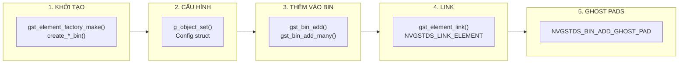
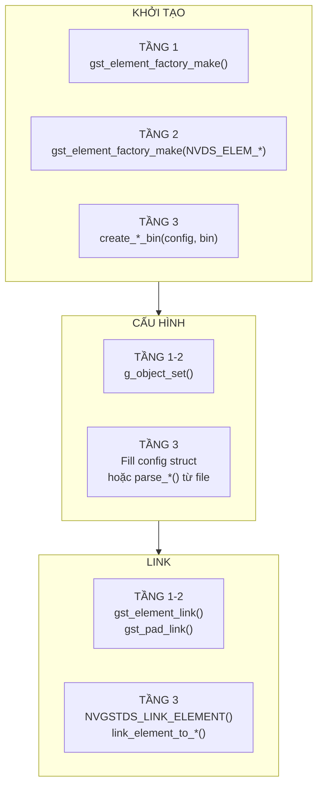

# DeepStream Pipeline Building: How-To Guide

> **Mục đích**: Hướng dẫn chi tiết cách khởi tạo elements/bins, cấu hình properties, và link chúng thành pipeline hoàn chỉnh ở từng tầng.

---

## 1. Tổng Quan Quy Trình Xây Dựng Pipeline



---

## 2. TẦNG 1: GStreamer Base Elements

### 2.1 Khởi Tạo Element

```c
// Cách duy nhất: sử dụng gst_element_factory_make()
GstElement *queue = gst_element_factory_make("queue", "my_queue");
GstElement *tee = gst_element_factory_make("tee", "my_tee");
GstElement *filesink = gst_element_factory_make("filesink", "my_filesink");

// Check NULL - LUÔN KIỂM TRA!
if (!queue) {
    g_printerr("Failed to create queue element\n");
    return FALSE;
}
```

### 2.2 Cấu Hình Properties

```c
// Cách 1: g_object_set() - set nhiều properties cùng lúc
g_object_set(G_OBJECT(filesink),
    "location", "/path/to/output.mp4",
    "sync", FALSE,
    NULL);  // PHẢI kết thúc bằng NULL

// Cách 2: g_object_set() từng property
g_object_set(G_OBJECT(queue), "max-size-buffers", 10, NULL);
g_object_set(G_OBJECT(queue), "leaky", 2, NULL);  // downstream

// Cách 3: Dùng macro NVDS
// Không có - phải dùng g_object_set()
```

### 2.3 Thêm Vào Pipeline/Bin

```c
GstElement *pipeline = gst_pipeline_new("my_pipeline");

// Cách 1: Thêm từng element
gst_bin_add(GST_BIN(pipeline), queue);
gst_bin_add(GST_BIN(pipeline), tee);

// Cách 2: Thêm nhiều elements cùng lúc (khuyên dùng)
gst_bin_add_many(GST_BIN(pipeline), queue, tee, filesink, NULL);
```

### 2.4 Link Elements

```c
// Cách 1: Link trực tiếp 2 elements
if (!gst_element_link(queue, tee)) {
    g_printerr("Failed to link queue -> tee\n");
    return FALSE;
}

// Cách 2: Link chain - nhiều elements theo thứ tự
gst_element_link_many(source, queue, sink, NULL);

// Cách 3: Link với pads cụ thể (cho request pads)
GstPad *src_pad = gst_element_get_static_pad(elem, "src");
GstPad *sink_pad = gst_element_get_static_pad(next_elem, "sink");
gst_pad_link(src_pad, sink_pad);
gst_object_unref(src_pad);
gst_object_unref(sink_pad);

// Cách 4: Request pad từ tee (dynamic linking)
GstPadTemplate *templ = gst_element_class_get_pad_template(
    GST_ELEMENT_GET_CLASS(tee), "src_%u");
GstPad *tee_pad = gst_element_request_pad(tee, templ, NULL, NULL);
// ... link tee_pad to sink_pad ...
```

---

## 3. TẦNG 2: NVIDIA DeepStream Plugin Elements

### 3.1 Khởi Tạo Element

Giống Tầng 1, nhưng dùng **NVIDIA element names**:

```c
// Sử dụng macro được định nghĩa trong deepstream_config.h
#include "deepstream_config.h"

GstElement *nvinfer = gst_element_factory_make(NVDS_ELEM_PGIE, "pgie");
GstElement *tracker = gst_element_factory_make(NVDS_ELEM_TRACKER, "tracker");
GstElement *osd = gst_element_factory_make(NVDS_ELEM_OSD, "osd");
GstElement *mux = gst_element_factory_make(NVDS_ELEM_STREAM_MUX, "mux");
GstElement *tiler = gst_element_factory_make(NVDS_ELEM_TILER, "tiler");

// Hoặc dùng tên string trực tiếp
GstElement *nvinfer = gst_element_factory_make("nvinfer", "pgie");
```

**Bảng Macro → Element Name**:

| Macro | Element Name |
|-------|--------------|
| `NVDS_ELEM_PGIE` | `nvinfer` |
| `NVDS_ELEM_TRACKER` | `nvtracker` |
| `NVDS_ELEM_OSD` | `nvdsosd` |
| `NVDS_ELEM_STREAM_MUX` | `nvstreammux` |
| `NVDS_ELEM_TILER` | `nvmultistreamtiler` |
| `NVDS_ELEM_VIDEO_CONV` | `nvvideoconvert` |

### 3.2 Cấu Hình Properties

#### nvinfer (Primary GIE)
```c
g_object_set(G_OBJECT(nvinfer),
    "config-file-path", "/path/to/infer_config.txt",
    "batch-size", 4,
    "interval", 0,
    "unique-id", 1,
    "gpu-id", 0,
    "model-engine-file", "/path/to/model.engine",
    "process-mode", 1,  // 1=Primary, 2=Secondary
    NULL);
```

#### nvtracker
```c
g_object_set(G_OBJECT(tracker),
    "tracker-width", 960,
    "tracker-height", 544,
    "ll-lib-file", "/opt/nvidia/deepstream/deepstream/lib/libnvds_nvmultiobjecttracker.so",
    "ll-config-file", "/path/to/tracker_config.yml",
    "gpu-id", 0,
    "display-tracking-id", TRUE,
    NULL);
```

#### nvstreammux
```c
g_object_set(G_OBJECT(mux),
    "batch-size", 4,
    "width", 1920,
    "height", 1080,
    "batched-push-timeout", 40000,  // microseconds
    "live-source", FALSE,
    "nvbuf-memory-type", 0,
    NULL);
```

#### nvdsosd
```c
g_object_set(G_OBJECT(osd),
    "display-clock", FALSE,
    "display-text", TRUE,
    "display-bbox", TRUE,
    "gpu-id", 0,
    "process-mode", 0,  // 0=CPU, 1=GPU, 2=HW
    NULL);
```

### 3.3 Link với nvstreammux (Special Case)

`nvstreammux` có **request sink pads** (`sink_0`, `sink_1`, ...):

```c
// Sử dụng utility function từ apps-common
#include "deepstream_common.h"

// Link source element vào muxer sink pad index 0
link_element_to_streammux_sink_pad(mux, source_bin, 0);

// Hoặc làm thủ công:
GstPad *mux_sink = gst_element_request_pad_simple(mux, "sink_0");
GstPad *src_pad = gst_element_get_static_pad(source_elem, "src");
gst_pad_link(src_pad, mux_sink);
gst_object_unref(mux_sink);
gst_object_unref(src_pad);
```

### 3.4 Link với nvstreamdemux (Special Case)

`nvstreamdemux` có **request src pads** (`src_0`, `src_1`, ...):

```c
// Sử dụng utility function
link_element_to_demux_src_pad(demux, sink_bin, 0);  // src_0

// Hoặc thủ công:
GstPad *demux_src = gst_element_request_pad_simple(demux, "src_0");
GstPad *sink_pad = gst_element_get_static_pad(sink_elem, "sink");
gst_pad_link(demux_src, sink_pad);
```

### 3.5 Link với tee Element

```c
// Sử dụng utility function
link_element_to_tee_src_pad(tee, sink_element);

// Hàm này tự động request pad mới từ tee
```

---

## 4. TẦNG 3: Application Wrapper Bins

### 4.1 Khởi Tạo Wrapper Bin

**Pattern chung**: Gọi `create_*_bin(config, bin_struct)`

```c
#include "deepstream_primary_gie.h"
#include "deepstream_tracker.h"
#include "deepstream_osd.h"

// 1. Khai báo config struct và bin struct
NvDsGieConfig pgie_config = {0};
NvDsPrimaryGieBin pgie_bin;

NvDsTrackerConfig tracker_config = {0};
NvDsTrackerBin tracker_bin;

NvDsOSDConfig osd_config = {0};
NvDsOSDBin osd_bin;

// 2. Fill config (xem phần 4.2)
// ...

// 3. Gọi hàm create_*_bin()
if (!create_primary_gie_bin(&pgie_config, &pgie_bin)) {
    g_printerr("Failed to create primary GIE bin\n");
    return FALSE;
}

if (!create_tracking_bin(&tracker_config, &tracker_bin)) {
    g_printerr("Failed to create tracker bin\n");
    return FALSE;
}

if (!create_osd_bin(&osd_config, &osd_bin)) {
    g_printerr("Failed to create OSD bin\n");
    return FALSE;
}
```

**Danh sách các hàm create_*_bin()**:

| Hàm | Header File | Config Struct | Bin Struct |
|-----|-------------|---------------|------------|
| `create_primary_gie_bin()` | `deepstream_primary_gie.h` | `NvDsGieConfig` | `NvDsPrimaryGieBin` |
| `create_secondary_gie_bin()` | `deepstream_secondary_gie.h` | `NvDsGieConfig[]` | `NvDsSecondaryGieBin` |
| `create_tracking_bin()` | `deepstream_tracker.h` | `NvDsTrackerConfig` | `NvDsTrackerBin` |
| `create_osd_bin()` | `deepstream_osd.h` | `NvDsOSDConfig` | `NvDsOSDBin` |
| `create_tiled_display_bin()` | `deepstream_tiled_display.h` | `NvDsTiledDisplayConfig` | `NvDsTiledDisplayBin` |
| `create_sink_bin()` | `deepstream_sinks.h` | `NvDsSinkSubBinConfig[]` | `NvDsSinkBin` |
| `create_multi_source_bin()` | `deepstream_sources.h` | `NvDsSourceConfig[]` | `NvDsSrcParentBin` |
| `create_preprocess_bin()` | `deepstream_preprocess.h` | `NvDsPreProcessConfig` | `NvDsPreProcessBin` |
| `create_dsanalytics_bin()` | `deepstream_dsanalytics.h` | `NvDsDsAnalyticsConfig` | `NvDsDsAnalyticsBin` |
| `create_dewarper_bin()` | `deepstream_dewarper.h` | `NvDsDewarperConfig` | `NvDsDewarperBin` |

### 4.2 Cấu Hình Config Struct

#### Cách 1: Fill thủ công trong code

```c
// Primary GIE Config
NvDsGieConfig pgie_config = {0};
pgie_config.enable = TRUE;
pgie_config.config_file_path = g_strdup("/path/to/infer_config.txt");
pgie_config.batch_size = 4;
pgie_config.is_batch_size_set = TRUE;
pgie_config.interval = 0;
pgie_config.is_interval_set = TRUE;
pgie_config.unique_id = 1;
pgie_config.is_unique_id_set = TRUE;
pgie_config.gpu_id = 0;
pgie_config.is_gpu_id_set = TRUE;
pgie_config.plugin_type = NV_DS_GIE_PLUGIN_INFER;  // hoặc NV_DS_GIE_PLUGIN_INFER_SERVER
pgie_config.model_engine_file_path = g_strdup("/path/to/model.engine");
pgie_config.nvbuf_memory_type = 0;
```

```c
// Tracker Config
NvDsTrackerConfig tracker_config = {0};
tracker_config.enable = TRUE;
tracker_config.width = 960;
tracker_config.height = 544;
tracker_config.gpu_id = 0;
tracker_config.ll_lib_file = g_strdup("/opt/nvidia/.../libnvds_nvmultiobjecttracker.so");
tracker_config.ll_config_file = g_strdup("/path/to/tracker_config.yml");
tracker_config.display_tracking_id = TRUE;
```

```c
// OSD Config
NvDsOSDConfig osd_config = {0};
osd_config.enable = TRUE;
osd_config.gpu_id = 0;
osd_config.draw_text = TRUE;
osd_config.draw_bbox = TRUE;
osd_config.text_size = 15;
osd_config.border_width = 1;
osd_config.font = g_strdup("Arial");
osd_config.enable_clock = FALSE;
osd_config.mode = 0;  // CPU mode
osd_config.nvbuf_memory_type = 0;
```

#### Cách 2: Parse từ config file (Khuyên dùng)

```c
#include "deepstream_config_file_parser.h"

NvDsConfig app_config = {0};
gchar *config_file = "/path/to/config.yml";

// Parse toàn bộ config file vào app_config struct
if (!parse_config_file(&app_config, config_file)) {
    g_printerr("Failed to parse config file\n");
    return FALSE;
}

// Giờ có thể dùng:
// - app_config.primary_gie_config
// - app_config.tracker_config
// - app_config.osd_config
// - app_config.tiled_display_config
// - app_config.source_config[i]
// - app_config.sink_sub_bin_config[i]
// etc.
```

#### Cách 3: Parse từng section (GKeyFile - cho .txt config)

```c
#include "deepstream_config_file_parser.h"

GKeyFile *key_file = g_key_file_new();
g_key_file_load_from_file(key_file, config_file, G_KEY_FILE_NONE, NULL);

// Parse từng section
NvDsGieConfig pgie_config = {0};
parse_gie(&pgie_config, key_file, "primary-gie", config_file);

NvDsTrackerConfig tracker_config = {0};
parse_tracker(&tracker_config, key_file, config_file);

NvDsOSDConfig osd_config = {0};
parse_osd(&osd_config, key_file);

g_key_file_free(key_file);
```

#### Cách 4: Parse từ YAML file (Khuyên dùng cho DeepStream 6.0+)

DeepStream cung cấp các hàm `parse_*_yaml()` trong `deepstream_config_yaml.h`:

```cpp
#include "deepstream_config_yaml.h"

gchar *cfg_file_path = "/path/to/config.yml";

// Parse từng section từ YAML file
NvDsGieConfig pgie_config = {0};
parse_gie_yaml(&pgie_config, "primary-gie", cfg_file_path);

NvDsTrackerConfig tracker_config = {0};
parse_tracker_yaml(&tracker_config, cfg_file_path);

NvDsOSDConfig osd_config = {0};
parse_osd_yaml(&osd_config, cfg_file_path);

NvDsStreammuxConfig mux_config = {0};
parse_streammux_yaml(&mux_config, cfg_file_path);

NvDsTiledDisplayConfig tiled_config = {0};
parse_tiled_display_yaml(&tiled_config, cfg_file_path);

NvDsSinkSubBinConfig sink_config = {0};
parse_sink_yaml(&sink_config, "sink0", cfg_file_path);

NvDsPreProcessConfig preprocess_config = {0};
parse_preprocess_yaml(&preprocess_config, cfg_file_path);

NvDsDsAnalyticsConfig analytics_config = {0};
parse_dsanalytics_yaml(&analytics_config, cfg_file_path);
```

**Bảng YAML Parser Functions**:

| YAML Section | Parser Function | Header | Config Struct |
|--------------|-----------------|--------|---------------|
| `primary-gie:` | `parse_gie_yaml()` | `deepstream_config_yaml.h` | `NvDsGieConfig` |
| `secondary-gie0:` | `parse_gie_yaml()` | - | `NvDsGieConfig` |
| `tracker:` | `parse_tracker_yaml()` | - | `NvDsTrackerConfig` |
| `osd:` | `parse_osd_yaml()` | - | `NvDsOSDConfig` |
| `streammux:` | `parse_streammux_yaml()` | - | `NvDsStreammuxConfig` |
| `tiled-display:` | `parse_tiled_display_yaml()` | - | `NvDsTiledDisplayConfig` |
| `sink0:`, `sink1:` | `parse_sink_yaml()` | - | `NvDsSinkSubBinConfig` |
| `pre-process:` | `parse_preprocess_yaml()` | - | `NvDsPreProcessConfig` |
| `nvds-analytics:` | `parse_dsanalytics_yaml()` | - | `NvDsDsAnalyticsConfig` |
| `dewarper:` | `parse_dewarper_yaml()` | - | `NvDsDewarperConfig` |
| `ds-example:` | `parse_dsexample_yaml()` | - | `NvDsDsExampleConfig` |
| `segvisual:` | `parse_segvisual_yaml()` | - | `NvDsSegVisualConfig` |
| `message-consumer:` | `parse_msgconsumer_yaml()` | - | `NvDsMsgConsumerConfig` |

#### Cách hoạt động của YAML Parser (yaml-cpp)

Các hàm `parse_*_yaml()` sử dụng thư viện **yaml-cpp**:

```cpp
// Ví dụ: parse_tracker_yaml() - Cách hoạt động nội bộ
gboolean parse_tracker_yaml(NvDsTrackerConfig *config, gchar *cfg_file_path) {
    // 1. Load YAML file
    YAML::Node configyml = YAML::LoadFile(cfg_file_path);
    
    // 2. Iterate qua các keys trong section "tracker"
    for (auto itr = configyml["tracker"].begin();
         itr != configyml["tracker"].end(); ++itr) {
        
        std::string paramKey = itr->first.as<std::string>();
        
        // 3. Map key → config struct field
        if (paramKey == "enable") {
            config->enable = itr->second.as<gboolean>();
        } else if (paramKey == "tracker-width") {
            config->width = itr->second.as<gint>();
        } else if (paramKey == "ll-lib-file") {
            std::string temp = itr->second.as<std::string>();
            // Convert relative path → absolute path
            config->ll_lib_file = get_absolute_file_path_yaml(...);
        }
        // ... more keys
    }
    return TRUE;
}
```

**YAML Config Example** (`config.yml`):

```yaml
primary-gie:
  enable: 1
  batch-size: 4
  interval: 0
  gie-unique-id: 1
  gpu-id: 0
  config-file: config_infer_primary.txt
  model-engine-file: models/resnet10.engine

tracker:
  enable: 1
  tracker-width: 960
  tracker-height: 544
  gpu-id: 0
  ll-lib-file: /opt/nvidia/deepstream/deepstream/lib/libnvds_nvmultiobjecttracker.so
  ll-config-file: config_tracker_NvDCF.yml
  display-tracking-id: 1

osd:
  enable: 1
  gpu-id: 0
  display-text: 1
  display-bbox: 1
  process-mode: 0
```

#### So sánh: GKeyFile (.txt) vs YAML (.yml)

| Tiêu chí | GKeyFile (.txt) | YAML (.yml) |
|----------|-----------------|-------------|
| **Thư viện** | GLib built-in | yaml-cpp |
| **Cú pháp** | INI-style `[section]` | YAML nested keys |
| **Parser functions** | `parse_*()` | `parse_*_yaml()` |
| **Khuyên dùng** | Legacy configs | DeepStream 6.0+ |
| **Source location** | `apps-common/src/*.c` | `apps-common/src/deepstream-yaml/*.cpp` |

### 4.3 Thêm Wrapper Bin vào Pipeline

```c
// Wrapper bin có field `bin` là GstElement*
// Thêm vào pipeline như bình thường
gst_bin_add(GST_BIN(pipeline), pgie_bin.bin);
gst_bin_add(GST_BIN(pipeline), tracker_bin.bin);
gst_bin_add(GST_BIN(pipeline), osd_bin.bin);

// Hoặc nhiều cùng lúc
gst_bin_add_many(GST_BIN(pipeline),
    pgie_bin.bin,
    tracker_bin.bin,
    osd_bin.bin,
    NULL);
```

### 4.4 Link Wrapper Bins

Wrapper bins đã có **ghost pads** (`sink`, `src`), nên link như elements thường:

```c
// Cách 1: Sử dụng gst_element_link()
gst_element_link(mux, pgie_bin.bin);
gst_element_link(pgie_bin.bin, tracker_bin.bin);
gst_element_link(tracker_bin.bin, osd_bin.bin);

// Cách 2: Sử dụng macro NVGSTDS_LINK_ELEMENT (từ deepstream_common.h)
// Macro này auto-goto done nếu link fail
NVGSTDS_LINK_ELEMENT(mux, pgie_bin.bin);
NVGSTDS_LINK_ELEMENT(pgie_bin.bin, tracker_bin.bin);
NVGSTDS_LINK_ELEMENT(tracker_bin.bin, osd_bin.bin);

// Cách 3: Link chain
gst_element_link_many(mux, pgie_bin.bin, tracker_bin.bin, osd_bin.bin, NULL);
```

### 4.5 Truy cập Internal Elements

Sau khi tạo bin, có thể truy cập các elements bên trong:

```c
// Primary GIE bin - truy cập nvinfer element
GstElement *nvinfer_elem = pgie_bin.primary_gie;
g_object_set(G_OBJECT(nvinfer_elem), "interval", 2, NULL);

// Tracker bin - truy cập nvtracker element
GstElement *tracker_elem = tracker_bin.tracker;

// OSD bin - truy cập nvdsosd element
GstElement *osd_elem = osd_bin.nvosd;

// Hữu ích khi cần thêm probe:
GstPad *src_pad = gst_element_get_static_pad(nvinfer_elem, "src");
gst_pad_add_probe(src_pad, GST_PAD_PROBE_TYPE_BUFFER, my_callback, NULL, NULL);
gst_object_unref(src_pad);
```

---

## 5. Full Example: Xây Dựng Pipeline Hoàn Chỉnh

```c
#include <gst/gst.h>
#include "deepstream_common.h"
#include "deepstream_sources.h"
#include "deepstream_primary_gie.h"
#include "deepstream_tracker.h"
#include "deepstream_osd.h"
#include "deepstream_tiled_display.h"
#include "deepstream_sinks.h"

gboolean create_pipeline(AppCtx *appCtx) {
    gboolean ret = FALSE;
    NvDsConfig *config = &appCtx->config;
    NvDsPipeline *pipeline = &appCtx->pipeline;
    
    // ====== BƯỚC 1: Tạo Pipeline ======
    pipeline->pipeline = gst_pipeline_new("deepstream-pipeline");
    if (!pipeline->pipeline) {
        NVGSTDS_ERR_MSG_V("Failed to create pipeline");
        goto done;
    }
    
    // ====== BƯỚC 2: Tạo Source Bin (multi-source + streammux) ======
    if (!create_multi_source_bin(
            config->num_source_sub_bins,
            config->source_config,
            &pipeline->multi_src_bin)) {
        NVGSTDS_ERR_MSG_V("Failed to create multi source bin");
        goto done;
    }
    gst_bin_add(GST_BIN(pipeline->pipeline), pipeline->multi_src_bin.bin);
    
    // ====== BƯỚC 3: Tạo Primary GIE Bin ======
    if (config->primary_gie_config.enable) {
        if (!create_primary_gie_bin(
                &config->primary_gie_config,
                &pipeline->common_elements.primary_gie_bin)) {
            goto done;
        }
        gst_bin_add(GST_BIN(pipeline->pipeline), 
                    pipeline->common_elements.primary_gie_bin.bin);
    }
    
    // ====== BƯỚC 4: Tạo Tracker Bin ======
    if (config->tracker_config.enable) {
        if (!create_tracking_bin(
                &config->tracker_config,
                &pipeline->common_elements.tracker_bin)) {
            goto done;
        }
        gst_bin_add(GST_BIN(pipeline->pipeline),
                    pipeline->common_elements.tracker_bin.bin);
    }
    
    // ====== BƯỚC 5: Tạo Tiled Display Bin ======
    if (config->tiled_display_config.enable) {
        if (!create_tiled_display_bin(
                &config->tiled_display_config,
                &pipeline->tiled_display_bin)) {
            goto done;
        }
        gst_bin_add(GST_BIN(pipeline->pipeline),
                    pipeline->tiled_display_bin.bin);
    }
    
    // ====== BƯỚC 6: Tạo OSD Bin ======
    if (config->osd_config.enable) {
        if (!create_osd_bin(
                &config->osd_config,
                &pipeline->instance_bins[0].osd_bin)) {
            goto done;
        }
        gst_bin_add(GST_BIN(pipeline->pipeline),
                    pipeline->instance_bins[0].osd_bin.bin);
    }
    
    // ====== BƯỚC 7: Tạo Sink Bin ======
    if (!create_sink_bin(
            config->num_sink_sub_bins,
            config->sink_sub_bin_config,
            &pipeline->instance_bins[0].sink_bin, 0)) {
        goto done;
    }
    gst_bin_add(GST_BIN(pipeline->pipeline),
                pipeline->instance_bins[0].sink_bin.bin);
    
    // ====== BƯỚC 8: Link tất cả ======
    GstElement *last_elem = pipeline->multi_src_bin.bin;
    
    if (config->primary_gie_config.enable) {
        NVGSTDS_LINK_ELEMENT(last_elem, 
                             pipeline->common_elements.primary_gie_bin.bin);
        last_elem = pipeline->common_elements.primary_gie_bin.bin;
    }
    
    if (config->tracker_config.enable) {
        NVGSTDS_LINK_ELEMENT(last_elem,
                             pipeline->common_elements.tracker_bin.bin);
        last_elem = pipeline->common_elements.tracker_bin.bin;
    }
    
    if (config->tiled_display_config.enable) {
        NVGSTDS_LINK_ELEMENT(last_elem, pipeline->tiled_display_bin.bin);
        last_elem = pipeline->tiled_display_bin.bin;
    }
    
    if (config->osd_config.enable) {
        NVGSTDS_LINK_ELEMENT(last_elem, pipeline->instance_bins[0].osd_bin.bin);
        last_elem = pipeline->instance_bins[0].osd_bin.bin;
    }
    
    NVGSTDS_LINK_ELEMENT(last_elem, pipeline->instance_bins[0].sink_bin.bin);
    
    ret = TRUE;
    
done:
    return ret;
}
```

---

## 6. Macros Hữu Ích (từ `deepstream_common.h`)

| Macro | Mục đích |
|-------|----------|
| `NVGSTDS_LINK_ELEMENT(elem1, elem2)` | Link 2 elements, goto done nếu fail |
| `NVGSTDS_BIN_ADD_GHOST_PAD(bin, elem, pad)` | Thêm ghost pad vào bin |
| `NVGSTDS_ELEM_ADD_PROBE(id, elem, pad, func, type, data)` | Thêm probe vào pad |
| `NVGSTDS_ERR_MSG_V(...)` | Print error message với function/line |
| `NVGSTDS_INFO_MSG_V(...)` | Print info message |

---

## 7. Utility Functions (từ `deepstream_common.c`)

```c
// Link element src pad vào streammux sink pad
gboolean link_element_to_streammux_sink_pad(
    GstElement *streammux,  // nvstreammux element
    GstElement *elem,       // upstream element  
    gint index              // sink pad index (0, 1, 2, ...)
);

// Unlink từ streammux
gboolean unlink_element_from_streammux_sink_pad(
    GstElement *streammux,
    GstElement *elem
);

// Link demux src pad vào element sink
gboolean link_element_to_demux_src_pad(
    GstElement *demux,      // nvstreamdemux element
    GstElement *elem,       // downstream element
    guint index             // src pad index (0, 1, 2, ...)
);

// Link element vào tee (auto-request new src pad)
gboolean link_element_to_tee_src_pad(
    GstElement *tee,        // tee element
    GstElement *sinkelem    // downstream element
);
```

---

## 8. Config Files: Mapping Section → Parser Function

| Config Section | Parser Function | Output Struct |
|---------------|-----------------|---------------|
| `[source0]`, `[source1]` | `parse_source()` | `NvDsSourceConfig` |
| `[streammux]` | `parse_streammux()` | `NvDsStreammuxConfig` |
| `[primary-gie]` | `parse_gie()` | `NvDsGieConfig` |
| `[secondary-gie0]` | `parse_gie()` | `NvDsGieConfig` |
| `[tracker]` | `parse_tracker()` | `NvDsTrackerConfig` |
| `[nvds-analytics]` | `parse_dsanalytics()` | `NvDsDsAnalyticsConfig` |
| `[osd]` | `parse_osd()` | `NvDsOSDConfig` |
| `[tiled-display]` | `parse_tiled_display()` | `NvDsTiledDisplayConfig` |
| `[sink0]`, `[sink1]` | `parse_sink()` | `NvDsSinkSubBinConfig` |
| `[pre-process]` | `parse_preprocess()` | `NvDsPreProcessConfig` |

---

## 9. Quick Reference Diagram


