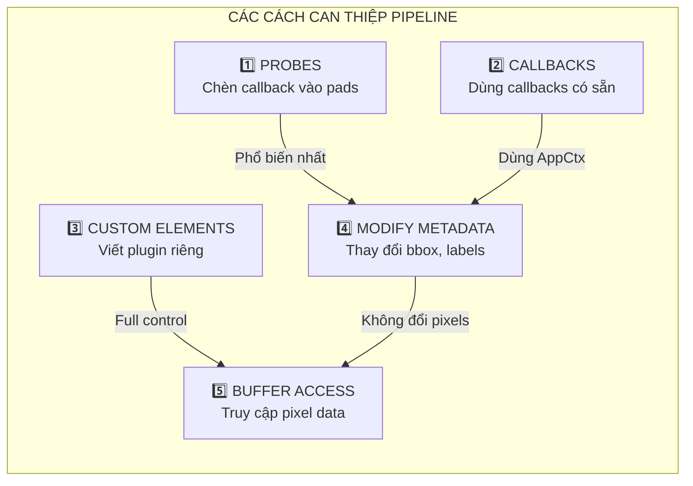
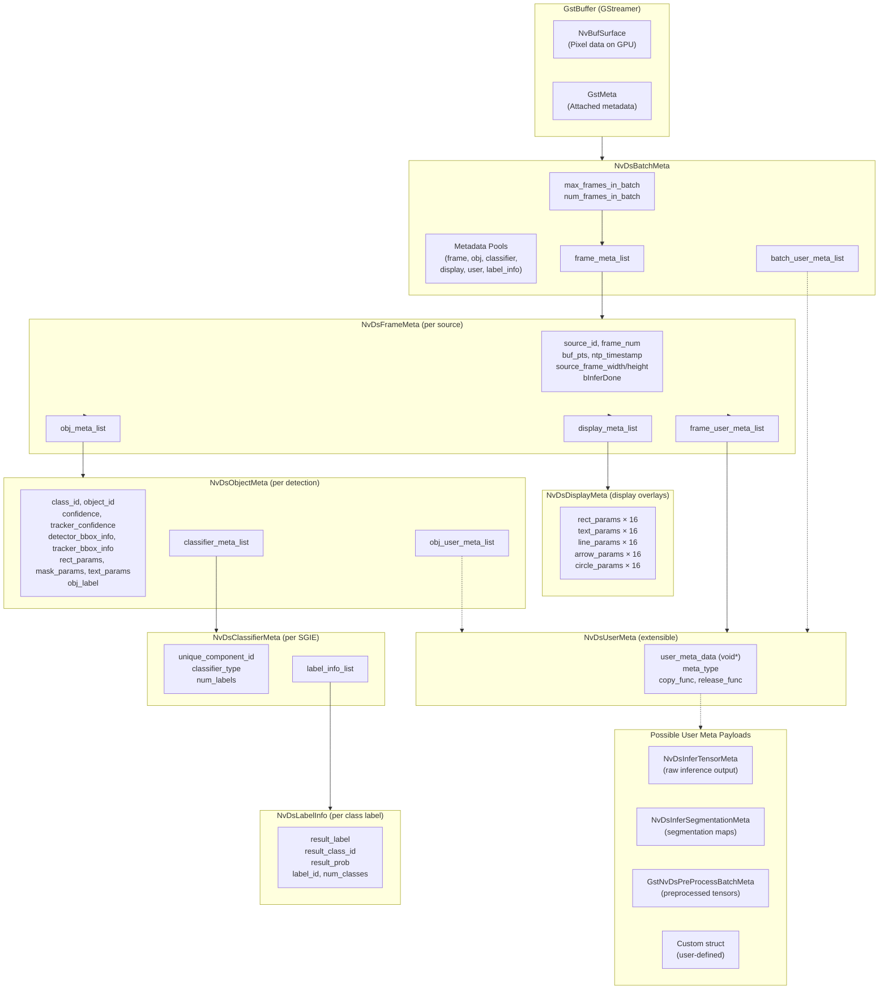
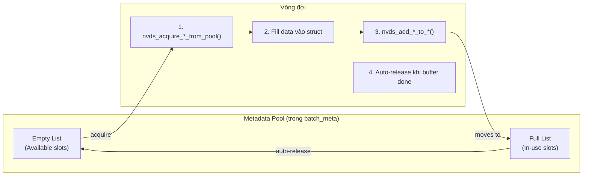
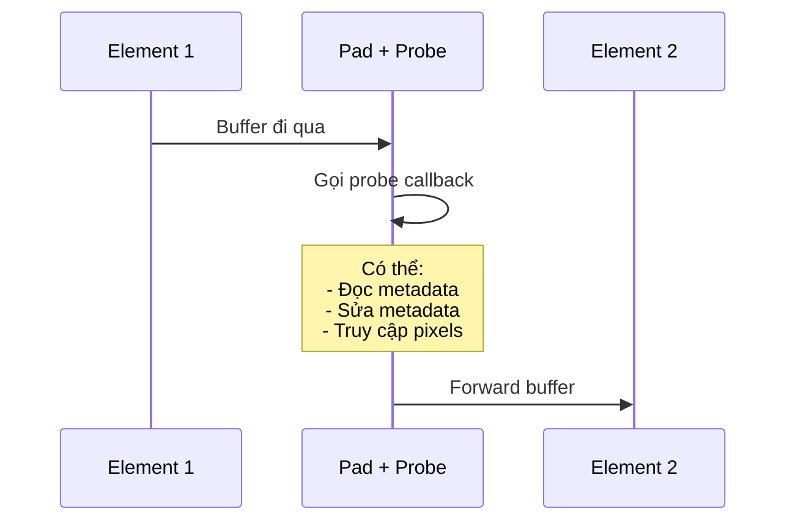
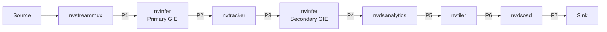

# DeepStream Pipeline Intervention: Can Thiệp & Tùy Biến Pipeline

> **Mục đích**: Hướng dẫn chi tiết cách can thiệp vào luồng data giữa các elements - chỉnh sửa metadata, thao tác pixels, và custom processing.

---

## 1. Tổng Quan Các Cách Can Thiệp



| Cách | Độ phức tạp | Khi nào dùng |
|------|-------------|--------------|
| **1. Probes** | ⭐ Dễ | Đọc/sửa metadata, không đổi cấu trúc pipeline |
| **2. Callbacks** | ⭐ Dễ | Dùng callbacks có sẵn trong AppCtx |
| **3. Custom Elements** | ⭐⭐⭐ Khó | Full control, cần viết GStreamer plugin |
| **4. Modify Metadata** | ⭐⭐ Trung bình | Sửa bbox, class, label, tracking ID |
| **5. Buffer Access** | ⭐⭐ Trung bình | Đọc/ghi pixel data (làm sáng ảnh...) |

---

## 2. Data Flow: Hiểu Dữ Liệu Truyền Qua Pipeline

### 2.1 Vị Trí Header Files (Định nghĩa Struct)

> [!IMPORTANT]
> Các metadata structs được định nghĩa trong **NVIDIA DeepStream SDK**, **KHÔNG** nằm trong codebase ứng dụng.

**Đường dẫn SDK Headers:**

```bash
/opt/nvidia/deepstream/deepstream-7.1/sources/includes/
├── nvdsmeta.h            # ⭐ QUAN TRỌNG NHẤT - NvDsBatchMeta, NvDsFrameMeta, NvDsObjectMeta...
├── gstnvdsmeta.h         # GStreamer integration - gst_buffer_get_nvds_batch_meta()
├── gstnvdsinfer.h        # ⭐ NvDsInferTensorMeta, NvDsInferSegmentationMeta
├── nvbufsurface.h        # NvBufSurface - pixel buffer access
├── nvll_osd_struct.h     # NvOSD_RectParams, NvOSD_TextParams, NvOSD_ColorParams...
├── nvds_roi_meta.h       # NvDsRoiMeta - Region of Interest
├── nvdsmeta_schema.h     # Event message schema (NvDsEventMsgMeta)
├── nvds_latency_meta.h   # Latency measurement metadata
└── ...

# Ngoài SDK includes, header của plugin riêng:
/opt/nvidia/deepstream/deepstream-7.1/sources/gst-plugins/
└── gst-nvdspreprocess/include/
    └── nvdspreprocess_meta.h  # ⭐ GstNvDsPreProcessBatchMeta, NvDsPreProcessTensorMeta
```

**Cách tìm định nghĩa struct bất kỳ:**

```bash
# Tìm file chứa định nghĩa struct
grep -r "typedef struct.*NvDsObjectMeta" /opt/nvidia/deepstream/

# Xem nội dung struct
grep -A 50 "typedef struct _NvDsObjectMeta" /opt/nvidia/deepstream/deepstream-7.1/sources/includes/nvdsmeta.h
```

**Include trong code:**

```c
#include "gstnvdsmeta.h"   // Để dùng gst_buffer_get_nvds_batch_meta()
#include "nvdsmeta.h"      // (được include tự động qua gstnvdsmeta.h)
#include "nvbufsurface.h"  // Để truy cập pixel data
#include "gstnvdsinfer.h"  // NvDsInferTensorMeta, NvDsInferSegmentationMeta

// Nếu dùng nvdspreprocess:
#include "nvdspreprocess_meta.h"  // GstNvDsPreProcessBatchMeta
```

---

### 2.2 Kiến Trúc Metadata Hierarchy




**Hierarchy dạng text (đầy đủ):**

```
GstBuffer
├── NvBufSurface (pixel data trên GPU)
└── NvDsBatchMeta (via gst_buffer_get_nvds_batch_meta())
    ├── max_frames_in_batch, num_frames_in_batch
    ├── meta_mutex (GRecMutex - thread-safety)
    │
    ├── === METADATA POOLS (pre-allocated) ===
    │   ├── frame_meta_pool      → NvDsFrameMeta
    │   ├── obj_meta_pool        → NvDsObjectMeta
    │   ├── classifier_meta_pool → NvDsClassifierMeta
    │   ├── display_meta_pool    → NvDsDisplayMeta
    │   ├── user_meta_pool       → NvDsUserMeta
    │   └── label_info_meta_pool → NvDsLabelInfo
    │
    ├── frame_meta_list (NvDsFrameMetaList = GList*)
    │   └── NvDsFrameMeta (for each source / frame in batch)
    │       ├── pad_index, batch_id
    │       ├── source_id, frame_num
    │       ├── buf_pts, ntp_timestamp
    │       ├── source_frame_width, source_frame_height
    │       ├── pipeline_width, pipeline_height
    │       ├── num_obj_meta, bInferDone
    │       │
    │       ├── obj_meta_list (NvDsObjectMetaList = GList*)
    │       │   └── NvDsObjectMeta (for each detection)
    │       │       ├── unique_component_id (which GIE produced this)
    │       │       ├── class_id, object_id (tracking ID)
    │       │       ├── confidence, tracker_confidence
    │       │       ├── detector_bbox_info (NvDsComp_BboxInfo - unclipped)
    │       │       ├── tracker_bbox_info  (NvDsComp_BboxInfo - from tracker)
    │       │       ├── rect_params (NvOSD_RectParams - for display)
    │       │       │   ├── left, top, width, height
    │       │       │   ├── border_width, border_color (NvOSD_ColorParams)
    │       │       │   └── has_bg_color, bg_color (NvOSD_ColorParams)
    │       │       ├── mask_params (NvOSD_MaskParams - segmentation)
    │       │       ├── text_params (NvOSD_TextParams - label display)
    │       │       ├── obj_label[MAX_LABEL_SIZE] (128 chars)
    │       │       ├── parent (NvDsObjectMeta* - nested detections)
    │       │       │
    │       │       ├── classifier_meta_list (NvDsClassifierMetaList = GList*)
    │       │       │   └── NvDsClassifierMeta (for each SGIE classification)
    │       │       │       ├── unique_component_id (which SGIE)
    │       │       │       ├── classifier_type (string)
    │       │       │       ├── num_labels
    │       │       │       └── label_info_list (NvDsLabelInfoList = GList*)
    │       │       │           └── NvDsLabelInfo (for each label result)
    │       │       │               ├── result_label[MAX_LABEL_SIZE]
    │       │       │               ├── pResult_label (if > MAX_LABEL_SIZE)
    │       │       │               ├── result_class_id
    │       │       │               ├── result_prob
    │       │       │               ├── label_id
    │       │       │               └── num_classes
    │       │       │
    │       │       └── obj_user_meta_list (NvDsUserMetaList = GList*)
    │       │           └── NvDsUserMeta → (see User Meta Payloads below)
    │       │
    │       ├── display_meta_list (NvDisplayMetaList = GList*)
    │       │   └── NvDsDisplayMeta (display overlays, MAX 16 each)
    │       │       ├── num_rects   → rect_params[16]   (NvOSD_RectParams)
    │       │       ├── num_labels  → text_params[16]   (NvOSD_TextParams)
    │       │       │                   ├── display_text, x_offset, y_offset
    │       │       │                   ├── font_params (font_name, font_size, font_color)
    │       │       │                   └── set_bg_clr, text_bg_clr
    │       │       ├── num_lines   → line_params[16]   (NvOSD_LineParams)
    │       │       │                   └── x1, y1, x2, y2, line_width, line_color
    │       │       ├── num_arrows  → arrow_params[16]  (NvOSD_ArrowParams)
    │       │       │                   └── x1, y1, x2, y2, arrow_width, arrow_head, arrow_color
    │       │       └── num_circles → circle_params[16] (NvOSD_CircleParams)
    │       │                           └── xc, yc, radius, circle_color, circle_width
    │       │
    │       └── frame_user_meta_list (NvDsUserMetaList = GList*)
    │           └── NvDsUserMeta → (see User Meta Payloads below)
    │
    └── batch_user_meta_list (NvDsUserMetaList = GList*)
        └── NvDsUserMeta → (see User Meta Payloads below)
```

**User Meta Payloads** (NvDsUserMeta chứa `void *user_meta_data`, phân biệt bằng `meta_type`):

```
NvDsUserMeta
├── base_meta.meta_type = NVDSINFER_TENSOR_OUTPUT_META
│   └── NvDsInferTensorMeta (raw inference output)
│       ├── unique_id (which nvinfer instance)
│       ├── num_output_layers
│       ├── output_layers_info (NvDsInferLayerInfo[])
│       ├── out_buf_ptrs_host, out_buf_ptrs_dev
│       ├── gpu_id
│       └── network_info (NvDsInferNetworkInfo)
│
├── base_meta.meta_type = NVDSINFER_SEGMENTATION_META
│   └── NvDsInferSegmentationMeta (segmentation model output)
│       ├── classes, width, height
│       ├── class_map (int* - pixel class map)
│       ├── class_probabilities_map (float*)
│       └── unique_id
│
├── base_meta.meta_type = NVDS_PREPROCESS_BATCH_META
│   └── GstNvDsPreProcessBatchMeta (from nvdspreprocess)
│       ├── target_unique_ids (vector<uint64>)
│       ├── tensor_meta → NvDsPreProcessTensorMeta
│       │   ├── raw_tensor_buffer, buffer_size
│       │   ├── tensor_shape, data_type, tensor_name
│       │   └── gpu_id, meta_id
│       └── roi_vector (vector<NvDsRoiMeta>)
│
├── base_meta.meta_type = NVDS_TRACKER_PAST_FRAME_META
│   └── NvDsTrackerPastFrameObjBatch (past frame tracking data)
│
├── base_meta.meta_type = NVDS_EVENT_MSG_META
│   └── NvDsEventMsgMeta (message payload for IoT/cloud)
│
└── base_meta.meta_type = NVDS_START_USER_META + N
    └── Custom user-defined struct (your own data)
```


---

### 2.3 Pool Architecture: acquire_from_pool & add_to_*

> [!NOTE]
> DeepStream sử dụng **memory pools** để quản lý metadata hiệu quả. **KHÔNG tự malloc() metadata** - phải lấy từ pool.

**Tại sao dùng Pool?**
- **Performance**: Pre-allocated memory, tránh malloc/free runtime
- **Thread-safety**: Pool có lock tích hợp
- **Memory reuse**: Metadata được recycle sau mỗi frame

**Quy tắc vàng:**
1. **Acquire from pool** → Lấy metadata object từ pool (đã allocated sẵn)
2. **Fill data** → Điền thông tin vào struct
3. **Add to parent** → Attach vào frame/batch/object
4. **Auto-release** → DeepStream tự release khi buffer kết thúc



**Các cặp hàm acquire/add:**

| Loại Meta | Acquire từ Pool | Add vào Parent |
|-----------|----------------|----------------|
| **Frame** | `nvds_acquire_frame_meta_from_pool(batch)` | `nvds_add_frame_meta_to_batch(batch, frame)` |
| **Object** | `nvds_acquire_obj_meta_from_pool(batch)` | `nvds_add_obj_meta_to_frame(frame, obj, parent)` |
| **Display** | `nvds_acquire_display_meta_from_pool(batch)` | `nvds_add_display_meta_to_frame(frame, display)` |
| **Classifier** | `nvds_acquire_classifier_meta_from_pool(batch)` | `nvds_add_classifier_meta_to_object(obj, classifier)` |
| **Label** | `nvds_acquire_label_info_meta_from_pool(batch)` | `nvds_add_label_info_meta_to_classifier(classifier, label)` |
| **User** | `nvds_acquire_user_meta_from_pool(batch)` | `nvds_add_user_meta_to_batch/frame/obj()` |

**Ví dụ: Thêm một display overlay**

```c
// ❌ SAI - Không tự malloc!
// NvDsDisplayMeta *display = g_malloc0(sizeof(NvDsDisplayMeta));

// ✅ ĐÚNG - Lấy từ pool
NvDsDisplayMeta *display = nvds_acquire_display_meta_from_pool(batch_meta);

// Fill data
display->num_labels = 1;
display->text_params[0].display_text = g_strdup("Hello");
display->text_params[0].x_offset = 50;
display->text_params[0].y_offset = 50;

// Attach to frame (moves from empty_list → full_list)
nvds_add_display_meta_to_frame(frame_meta, display);

// ❌ KHÔNG cần free - DeepStream tự xử lý khi buffer kết thúc
```

**Ví dụ: Thêm một object detection (giả lập)**

```c
// Lấy obj_meta từ pool
NvDsObjectMeta *obj = nvds_acquire_obj_meta_from_pool(batch_meta);

// Fill detection data
obj->class_id = 2;  // Person
obj->confidence = 0.95;
obj->rect_params.left = 100;
obj->rect_params.top = 200;
obj->rect_params.width = 150;
obj->rect_params.height = 300;
g_strlcpy(obj->obj_label, "Person", MAX_LABEL_SIZE);

// Attach to frame (NULL = no parent object)
nvds_add_obj_meta_to_frame(frame_meta, obj, NULL);
```

---

### 2.4 Các Struct Quan Trọng (Full Definition)

> [!TIP]
> Xem full definition trong `/opt/nvidia/deepstream/deepstream-7.1/sources/includes/nvdsmeta.h`

**NvDsBatchMeta** - Top-level container:

```c
typedef struct _NvDsBatchMeta {
  NvDsBaseMeta base_meta;
  guint max_frames_in_batch;      // Maximum frames
  guint num_frames_in_batch;      // Current frame count
  
  // === METADATA POOLS ===
  NvDsMetaPool *frame_meta_pool;      // Pool for NvDsFrameMeta
  NvDsMetaPool *obj_meta_pool;        // Pool for NvDsObjectMeta
  NvDsMetaPool *classifier_meta_pool; // Pool for NvDsClassifierMeta
  NvDsMetaPool *display_meta_pool;    // Pool for NvDsDisplayMeta
  NvDsMetaPool *user_meta_pool;       // Pool for NvDsUserMeta
  NvDsMetaPool *label_info_meta_pool; // Pool for NvDsLabelInfo
  
  // === ATTACHED METADATA ===
  NvDsFrameMetaList *frame_meta_list;    // List of frame metas
  NvDsUserMetaList *batch_user_meta_list; // Batch-level user meta
  
  GRecMutex meta_mutex;  // Lock for thread-safety
  gint64 misc_batch_info[MAX_USER_FIELDS];
} NvDsBatchMeta;
```

**NvDsFrameMeta** - Per-source frame info:

```c
typedef struct _NvDsFrameMeta {
  NvDsBaseMeta base_meta;
  guint pad_index;              // Streammux pad index
  guint batch_id;               // Position in batch
  gint frame_num;               // Frame number from source
  guint64 buf_pts;              // Presentation timestamp
  guint64 ntp_timestamp;        // NTP timestamp
  guint source_id;              // Camera/source ID
  guint source_frame_width;     // Original width
  guint source_frame_height;    // Original height
  guint pipeline_width;         // After streammux scaling
  guint pipeline_height;
  guint num_obj_meta;           // Object count
  gboolean bInferDone;          // Inference completed?
  
  // === ATTACHED METADATA ===
  NvDsObjectMetaList *obj_meta_list;      // Detected objects
  NvDisplayMetaList *display_meta_list;   // Display overlays
  NvDsUserMetaList *frame_user_meta_list; // Custom metadata
  
  gint64 misc_frame_info[MAX_USER_FIELDS];
} NvDsFrameMeta;
```

**NvDsObjectMeta** - Per-detection info:

```c
typedef struct _NvDsObjectMeta {
  NvDsBaseMeta base_meta;
  struct _NvDsObjectMeta *parent;  // Parent object (for nested detections)
  gint unique_component_id;        // Which GIE produced this
  gint class_id;                   // Class index
  guint64 object_id;               // Tracking ID (UNTRACKED_OBJECT_ID = 0xFFFFFFFFFFFFFFFF)
  
  NvDsComp_BboxInfo detector_bbox_info;   // Bbox from detector
  NvDsComp_BboxInfo tracker_bbox_info;    // Bbox from tracker
  gfloat confidence;              // Detection confidence (-0.1 if unavailable)
  gfloat tracker_confidence;      // Tracker confidence
  
  NvOSD_RectParams rect_params;   // ⭐ Bounding box for display
  NvOSD_MaskParams mask_params;   // Segmentation mask
  NvOSD_TextParams text_params;   // Label text params
  gchar obj_label[MAX_LABEL_SIZE]; // Label string (128 chars)
  
  // === ATTACHED METADATA ===
  NvDsClassifierMetaList *classifier_meta_list; // Classification results
  NvDsUserMetaList *obj_user_meta_list;         // Custom metadata
  
  gint64 misc_obj_info[MAX_USER_FIELDS];
} NvDsObjectMeta;
```

**NvOSD_RectParams** - Bounding box (from `nvll_osd_struct.h`):

```c
typedef struct {
  float left;           // X coordinate (top-left)
  float top;            // Y coordinate (top-left)
  float width;          // Box width
  float height;         // Box height
  unsigned int border_width;        // Border thickness
  NvOSD_ColorParams border_color;   // Border RGBA
  unsigned int has_bg_color;        // Fill background?
  NvOSD_ColorParams bg_color;       // Background RGBA
  unsigned int has_color_info;
  int color_id;
} NvOSD_RectParams;
```

**NvOSD_ColorParams**:

```c
typedef struct {
  double red;     // 0.0 - 1.0
  double green;   // 0.0 - 1.0
  double blue;    // 0.0 - 1.0
  double alpha;   // 0.0 - 1.0
} NvOSD_ColorParams;
```

**NvDsDisplayMeta** - Display overlays:

```c
typedef struct NvDsDisplayMeta {
  NvDsBaseMeta base_meta;
  guint num_rects;     // Number of rectangles
  guint num_labels;    // Number of text labels
  guint num_lines;     // Number of lines
  guint num_arrows;    // Number of arrows
  guint num_circles;   // Number of circles
  
  NvOSD_RectParams rect_params[MAX_ELEMENTS_IN_DISPLAY_META];    // 16 rects max
  NvOSD_TextParams text_params[MAX_ELEMENTS_IN_DISPLAY_META];    // 16 texts max
  NvOSD_LineParams line_params[MAX_ELEMENTS_IN_DISPLAY_META];    // 16 lines max
  NvOSD_ArrowParams arrow_params[MAX_ELEMENTS_IN_DISPLAY_META];  // 16 arrows max
  NvOSD_CircleParams circle_params[MAX_ELEMENTS_IN_DISPLAY_META];// 16 circles max
} NvDsDisplayMeta;
```

**NvDsClassifierMeta** - Classification results (from SGIE):

```c
typedef struct _NvDsClassifierMeta {
  NvDsBaseMeta base_meta;
  guint num_labels;          // Số lượng labels từ classifier
  gint unique_component_id;  // ID nào của SGIE tạo ra meta này
  NvDsLabelInfoList *label_info_list;  // Danh sách labels
  const gchar *classifier_type;        // Loại classifier (string)
} NvDsClassifierMeta;
```

**NvDsLabelInfo** - Label info cho classifier:

```c
typedef struct _NvDsLabelInfo {
  NvDsBaseMeta base_meta;
  guint num_classes;              // Số classes
  gchar result_label[MAX_LABEL_SIZE]; // Label string (128 chars)
  gchar *pResult_label;           // Pointer nếu label dài > MAX_LABEL_SIZE
  guint result_class_id;          // Class ID kết quả tốt nhất
  guint label_id;                 // Label ID (khi có nhiều classifier)
  gfloat result_prob;             // Probability kết quả tốt nhất
} NvDsLabelInfo;
```

**NvDsUserMeta** - User metadata container (extensible):

```c
typedef struct _NvDsUserMeta {
  NvDsBaseMeta base_meta;
  // base_meta.meta_type xác định loại payload:
  //   NVDSINFER_TENSOR_OUTPUT_META → NvDsInferTensorMeta
  //   NVDSINFER_SEGMENTATION_META  → NvDsInferSegmentationMeta
  //   NVDS_PREPROCESS_BATCH_META   → GstNvDsPreProcessBatchMeta
  //   NVDS_START_USER_META + N     → Custom user struct
  //
  // base_meta.copy_func, release_func: callbacks to manage lifecycle
  
  void *user_meta_data;  // ⭐ Pointer to actual payload (cast dựa vào meta_type)
} NvDsUserMeta;
```

**NvDsInferTensorMeta** - Raw inference output (from `gstnvdsinfer.h`):

> [!NOTE]
> Được attach khi set `output-tensor-meta=1` cho nvinfer element. Nằm trong `frame_user_meta_list` hoặc `obj_user_meta_list` với `meta_type = NVDSINFER_TENSOR_OUTPUT_META`.

```c
typedef struct {
  guint unique_id;               // ID nvinfer instance gắn meta này
  guint num_output_layers;       // Số output layers
  NvDsInferLayerInfo *output_layers_info;  // Thông tin layers (name, dims, dataType)
  void **out_buf_ptrs_host;      // Pointers tới output buffers trên CPU
  void **out_buf_ptrs_dev;       // Pointers tới output buffers trên GPU
  gint gpu_id;                   // GPU device ID
  NvDsInferNetworkInfo network_info;  // {width, height, channels}
  gboolean maintain_aspect_ratio;
  gboolean symmetric_padding;
  void *priv_data;               // Internal - không dùng
} NvDsInferTensorMeta;
```

**NvDsInferSegmentationMeta** - Segmentation output (from `gstnvdsinfer.h`):

```c
typedef struct {
  guint classes;        // Số classes trong segmentation output
  guint width;          // Width của class map
  guint height;         // Height của class map
  gint *class_map;      // 2D pixel class map [y * width + x]
  gfloat *class_probabilities_map;  // Prob cho class c, pixel (x,y):
                                     //   [c * width * height + y * width + x]
  gint unique_id;       // ID nvinfer instance
  void *priv_data;      // Internal
} NvDsInferSegmentationMeta;
```

**GstNvDsPreProcessBatchMeta** - Preprocess output (from `nvdspreprocess_meta.h`):

> [!NOTE]
> Được attach ở batch level (`batch_user_meta_list`) với `meta_type = NVDS_PREPROCESS_BATCH_META`.

```cpp
// Lưu ý: Struct dùng C++ (std::vector, std::string)
typedef struct {
  std::vector<guint64> target_unique_ids;  // GIE nào sử dụng tensor này
  NvDsPreProcessTensorMeta *tensor_meta;   // Tensor đã chuẩn bị
  std::vector<NvDsRoiMeta> roi_vector;     // ROIs per batch
  void *private_data;                      // Internal
} GstNvDsPreProcessBatchMeta;

typedef struct {
  void *raw_tensor_buffer;       // Buffer chứa tensor đã transform
  guint64 buffer_size;           // Kích thước buffer
  std::vector<int> tensor_shape; // Shape (e.g. {batch, C, H, W})
  NvDsDataType data_type;        // FP32, FP16, INT8...
  std::string tensor_name;       // Tên layer input của model
  guint gpu_id;
  guint meta_id;                 // Phân biệt khi có nhiều tensor meta
  gboolean maintain_aspect_ratio;
} NvDsPreProcessTensorMeta;
```

---

### 2.5 NvDsMetaType - Bảng Tham Chiếu Đầy Đủ

> [!TIP]
> `NvDsMetaType` là enum xác định loại metadata. Dùng để phân biệt `NvDsUserMeta.base_meta.meta_type` khi iterate qua user meta.

| Enum | Giá trị | Mô tả | Struct tương ứng |
|------|---------|-------|------------------|
| `NVDS_BATCH_META` | 1 | Batch-level metadata | `NvDsBatchMeta` |
| `NVDS_FRAME_META` | 2 | Frame-level metadata | `NvDsFrameMeta` |
| `NVDS_OBJ_META` | 3 | Object-level metadata | `NvDsObjectMeta` |
| `NVDS_DISPLAY_META` | 4 | Display overlay metadata | `NvDsDisplayMeta` |
| `NVDS_CLASSIFIER_META` | 5 | Classifier result | `NvDsClassifierMeta` |
| `NVDS_LABEL_INFO_META` | 6 | Label info | `NvDsLabelInfo` |
| `NVDS_USER_META` | 7 | Generic user metadata | `NvDsUserMeta` |
| `NVDS_PAYLOAD_META` | 8 | Message converter payload | - |
| `NVDS_EVENT_MSG_META` | 9 | Event message (IoT) | `NvDsEventMsgMeta` |
| `NVDS_OPTICAL_FLOW_META` | 10 | Optical flow | - |
| `NVDS_LATENCY_MEASUREMENT_META` | 11 | Latency measurement | `NvDsLatencyInfo` |
| `NVDSINFER_TENSOR_OUTPUT_META` | 12 | Raw inference output | `NvDsInferTensorMeta` |
| `NVDSINFER_SEGMENTATION_META` | 13 | Segmentation output | `NvDsInferSegmentationMeta` |
| `NVDS_CROP_IMAGE_META` | 14 | JPEG-encoded crops | - |
| `NVDS_TRACKER_PAST_FRAME_META` | 15 | Tracker past frame data | `NvDsTrackerPastFrameObjBatch` |
| `NVDS_PREPROCESS_BATCH_META` | - | Preprocess batch meta | `GstNvDsPreProcessBatchMeta` |
| `NVDS_START_USER_META` | 8193+ | Custom user-defined | User struct |


---

### 2.6 Iterate Qua Metadata (Pattern Chuẩn)

```c
NvDsBatchMeta *batch_meta = gst_buffer_get_nvds_batch_meta(buf);

// Iterate qua từng frame trong batch
for (NvDsMetaList *l_frame = batch_meta->frame_meta_list;
     l_frame != NULL;
     l_frame = l_frame->next) {
    
    NvDsFrameMeta *frame_meta = (NvDsFrameMeta *)l_frame->data;
    
    g_print("Frame %d from source %d: %d objects\n",
            frame_meta->frame_num,
            frame_meta->source_id,
            frame_meta->num_obj_meta);
    
    // Iterate qua từng object trong frame
    for (NvDsMetaList *l_obj = frame_meta->obj_meta_list;
         l_obj != NULL;
         l_obj = l_obj->next) {
        
        NvDsObjectMeta *obj_meta = (NvDsObjectMeta *)l_obj->data;
        
        g_print("  Object: class=%d, conf=%.2f, tracking_id=%lu\n",
                obj_meta->class_id,
                obj_meta->confidence,
                obj_meta->object_id);
        
        g_print("  Bbox: left=%.1f, top=%.1f, width=%.1f, height=%.1f\n",
                obj_meta->rect_params.left,
                obj_meta->rect_params.top,
                obj_meta->rect_params.width,
                obj_meta->rect_params.height);
    }
}
```

---

## 3. Phương Pháp 1: Probes (Khuyên dùng)

### 3.1 Khái Niệm Probe

**Probe** là callback được gắn vào **pad** của element, được gọi mỗi khi buffer đi qua.



### 3.2 Cách Thêm Probe

```c
#include <gst/gst.h>
#include "gstnvdsmeta.h"

// 1. Định nghĩa callback function
static GstPadProbeReturn
my_probe_callback(GstPad *pad, GstPadProbeInfo *info, gpointer user_data) {
    GstBuffer *buf = GST_PAD_PROBE_INFO_BUFFER(info);
    
    // Lấy batch metadata
    NvDsBatchMeta *batch_meta = gst_buffer_get_nvds_batch_meta(buf);
    if (!batch_meta) {
        return GST_PAD_PROBE_OK;
    }
    
    // === Xử lý tại đây ===
    
    return GST_PAD_PROBE_OK;  // Tiếp tục forward buffer
}

// 2. Gắn probe vào pad
GstPad *sink_pad = gst_element_get_static_pad(nvosd, "sink");
gulong probe_id = gst_pad_add_probe(
    sink_pad,
    GST_PAD_PROBE_TYPE_BUFFER,    // Loại probe
    my_probe_callback,            // Callback function
    user_data,                    // User data
    NULL                          // Destroy callback
);
gst_object_unref(sink_pad);

// 3. Gỡ probe (nếu cần)
gst_pad_remove_probe(sink_pad, probe_id);
```

### 3.3 Probe Types

| Type | Khi được gọi |
|------|-------------|
| `GST_PAD_PROBE_TYPE_BUFFER` | Mỗi buffer đi qua |
| `GST_PAD_PROBE_TYPE_EVENT` | Mỗi event (EOS, flush...) |
| `GST_PAD_PROBE_TYPE_QUERY` | Mỗi query |
| `GST_PAD_PROBE_TYPE_BUFFER_LIST` | Buffer list |

### 3.4 Probe Return Values

| Return Value | Ý nghĩa |
|--------------|---------|
| `GST_PAD_PROBE_OK` | Tiếp tục forward buffer bình thường |
| `GST_PAD_PROBE_DROP` | **Drop buffer** - không forward tiếp |
| `GST_PAD_PROBE_REMOVE` | Gỡ probe sau lần gọi này |
| `GST_PAD_PROBE_HANDLED` | Probe đã xử lý, không gọi probe khác |

### 3.5 Vị Trí Gắn Probe



| Vị trí | Data có sẵn | Use case |
|--------|-------------|----------|
| **P1** (sau mux) | Chỉ có frames | Tiền xử lý ảnh |
| **P2** (sau PGIE) | Frames + detections | Lọc/sửa bbox trước tracking |
| **P3** (sau Tracker) | Frames + tracked objects | Analytics với tracking ID |
| **P4** (sau SGIE) | Frames + all inferences | Sau khi có classification |
| **P5** (sau Analytics) | Frames + analytics meta | Khai thác counting results |
| **P6** (sau Tiler) | Tiled frame | Trước vẽ OSD |
| **P7** (sau OSD) | Final rendered frame | Cuối pipeline |

---

## 4. Phương Pháp 2: Callbacks trong AppCtx

DeepStream-app cung cấp các callback points có sẵn:

### 4.1 Các Callback Types

```c
// Định nghĩa trong deepstream_app.h
typedef void (*bbox_generated_callback)(
    AppCtx *appCtx, 
    GstBuffer *buf, 
    NvDsBatchMeta *batch_meta, 
    guint index
);

typedef gboolean (*overlay_graphics_callback)(
    AppCtx *appCtx, 
    GstBuffer *buf, 
    NvDsBatchMeta *batch_meta, 
    guint index
);
```

### 4.2 Gán Callbacks

```c
// Trong main() hoặc initialization
appCtx->all_bbox_generated_cb = my_bbox_callback;           // Sau tất cả GIEs
appCtx->bbox_generated_post_analytics_cb = my_analytics_callback;  // Sau analytics
appCtx->overlay_graphics_cb = my_overlay_callback;         // Trước vẽ OSD
```

### 4.3 Ví dụ: Callback đếm objects

```c
void my_bbox_callback(AppCtx *appCtx, GstBuffer *buf, 
                      NvDsBatchMeta *batch_meta, guint index) {
    NvDsMetaList *l_frame = NULL;
    NvDsMetaList *l_obj = NULL;
    guint person_count = 0;
    
    for (l_frame = batch_meta->frame_meta_list; l_frame != NULL;
         l_frame = l_frame->next) {
        NvDsFrameMeta *frame_meta = (NvDsFrameMeta *)l_frame->data;
        
        for (l_obj = frame_meta->obj_meta_list; l_obj != NULL;
             l_obj = l_obj->next) {
            NvDsObjectMeta *obj_meta = (NvDsObjectMeta *)l_obj->data;
            
            if (obj_meta->class_id == PGIE_CLASS_ID_PERSON) {
                person_count++;
            }
        }
    }
    g_print("Person count: %u\n", person_count);
}
```

---

## 5. Ví Dụ Thực Tế: Các Trường Hợp Sử Dụng

### 5.1 Nới rộng Bounding Box 10% trước Tracking

```c
static GstPadProbeReturn
expand_bbox_probe(GstPad *pad, GstPadProbeInfo *info, gpointer user_data) {
    GstBuffer *buf = GST_PAD_PROBE_INFO_BUFFER(info);
    NvDsBatchMeta *batch_meta = gst_buffer_get_nvds_batch_meta(buf);
    
    NvDsMetaList *l_frame = NULL;
    NvDsMetaList *l_obj = NULL;
    
    for (l_frame = batch_meta->frame_meta_list; l_frame != NULL;
         l_frame = l_frame->next) {
        NvDsFrameMeta *frame_meta = (NvDsFrameMeta *)l_frame->data;
        
        for (l_obj = frame_meta->obj_meta_list; l_obj != NULL;
             l_obj = l_obj->next) {
            NvDsObjectMeta *obj_meta = (NvDsObjectMeta *)l_obj->data;
            NvOSD_RectParams *rect = &obj_meta->rect_params;
            
            // Tính expansion
            gfloat expand_w = rect->width * 0.1;
            gfloat expand_h = rect->height * 0.1;
            
            // Mở rộng bbox 10%
            rect->left = MAX(0, rect->left - expand_w / 2);
            rect->top = MAX(0, rect->top - expand_h / 2);
            rect->width += expand_w;
            rect->height += expand_h;
            
            // Clamp to frame bounds
            if (rect->left + rect->width > frame_meta->source_frame_width) {
                rect->width = frame_meta->source_frame_width - rect->left;
            }
            if (rect->top + rect->height > frame_meta->source_frame_height) {
                rect->height = frame_meta->source_frame_height - rect->top;
            }
        }
    }
    return GST_PAD_PROBE_OK;
}

// Gắn probe SAU PGIE, TRƯỚC tracker
GstPad *pgie_src_pad = gst_element_get_static_pad(pgie, "src");
gst_pad_add_probe(pgie_src_pad, GST_PAD_PROBE_TYPE_BUFFER,
                  expand_bbox_probe, NULL, NULL);
```

### 5.2 Lọc bỏ Noise Boxes (confidence thấp, size nhỏ)

```c
static GstPadProbeReturn
filter_noise_probe(GstPad *pad, GstPadProbeInfo *info, gpointer user_data) {
    GstBuffer *buf = GST_PAD_PROBE_INFO_BUFFER(info);
    NvDsBatchMeta *batch_meta = gst_buffer_get_nvds_batch_meta(buf);
    
    NvDsMetaList *l_frame = NULL;
    NvDsMetaList *l_obj = NULL;
    NvDsMetaList *l_obj_next = NULL;
    
    for (l_frame = batch_meta->frame_meta_list; l_frame != NULL;
         l_frame = l_frame->next) {
        NvDsFrameMeta *frame_meta = (NvDsFrameMeta *)l_frame->data;
        
        for (l_obj = frame_meta->obj_meta_list; l_obj != NULL;
             l_obj = l_obj_next) {
            l_obj_next = l_obj->next;  // Lưu next trước khi xóa
            NvDsObjectMeta *obj_meta = (NvDsObjectMeta *)l_obj->data;
            
            gfloat area = obj_meta->rect_params.width * 
                          obj_meta->rect_params.height;
            
            // Lọc: confidence < 0.5 HOẶC area < 100 pixels
            if (obj_meta->confidence < 0.5 || area < 100) {
                // Xóa object khỏi list
                nvds_remove_obj_meta_from_frame(frame_meta, obj_meta);
            }
        }
    }
    return GST_PAD_PROBE_OK;
}
```

### 5.3 Tự Viết NMS (Non-Maximum Suppression)

```c
static gboolean compute_iou(NvOSD_RectParams *a, NvOSD_RectParams *b) {
    gfloat x1 = MAX(a->left, b->left);
    gfloat y1 = MAX(a->top, b->top);
    gfloat x2 = MIN(a->left + a->width, b->left + b->width);
    gfloat y2 = MIN(a->top + a->height, b->top + b->height);
    
    if (x2 < x1 || y2 < y1) return 0.0;
    
    gfloat intersection = (x2 - x1) * (y2 - y1);
    gfloat area_a = a->width * a->height;
    gfloat area_b = b->width * b->height;
    gfloat union_area = area_a + area_b - intersection;
    
    return intersection / union_area;
}

static GstPadProbeReturn
custom_nms_probe(GstPad *pad, GstPadProbeInfo *info, gpointer user_data) {
    GstBuffer *buf = GST_PAD_PROBE_INFO_BUFFER(info);
    NvDsBatchMeta *batch_meta = gst_buffer_get_nvds_batch_meta(buf);
    
    gfloat iou_threshold = 0.5;
    
    for (NvDsMetaList *l_frame = batch_meta->frame_meta_list; 
         l_frame != NULL; l_frame = l_frame->next) {
        NvDsFrameMeta *frame_meta = (NvDsFrameMeta *)l_frame->data;
        
        // Sort by confidence (descending) - simplified
        // Build list of objects
        GList *obj_list = NULL;
        for (NvDsMetaList *l = frame_meta->obj_meta_list; l != NULL; l = l->next) {
            obj_list = g_list_append(obj_list, l->data);
        }
        
        // NMS: mark suppressed objects
        for (GList *i = obj_list; i != NULL; i = i->next) {
            NvDsObjectMeta *obj_i = (NvDsObjectMeta *)i->data;
            if (obj_i->confidence < 0) continue;  // Already suppressed
            
            for (GList *j = i->next; j != NULL; j = j->next) {
                NvDsObjectMeta *obj_j = (NvDsObjectMeta *)j->data;
                if (obj_j->confidence < 0) continue;
                if (obj_i->class_id != obj_j->class_id) continue;
                
                gfloat iou = compute_iou(&obj_i->rect_params, &obj_j->rect_params);
                if (iou > iou_threshold) {
                    // Suppress object with lower confidence
                    if (obj_i->confidence > obj_j->confidence) {
                        nvds_remove_obj_meta_from_frame(frame_meta, obj_j);
                    } else {
                        nvds_remove_obj_meta_from_frame(frame_meta, obj_i);
                        break;
                    }
                }
            }
        }
        g_list_free(obj_list);
    }
    return GST_PAD_PROBE_OK;
}
```

### 5.4 Thay Đổi Label/Class

```c
// Đổi tên label
g_strlcpy(obj_meta->obj_label, "MyCustomLabel", sizeof(obj_meta->obj_label));

// Đổi class ID
obj_meta->class_id = 99;

// Đổi màu bbox
obj_meta->rect_params.border_color.red = 0.0;
obj_meta->rect_params.border_color.green = 1.0;
obj_meta->rect_params.border_color.blue = 0.0;
obj_meta->rect_params.border_color.alpha = 1.0;
```

### 5.5 Thêm Display Metadata (Text, Lines, Circles)

```c
static GstPadProbeReturn
add_overlay_probe(GstPad *pad, GstPadProbeInfo *info, gpointer user_data) {
    GstBuffer *buf = GST_PAD_PROBE_INFO_BUFFER(info);
    NvDsBatchMeta *batch_meta = gst_buffer_get_nvds_batch_meta(buf);
    
    for (NvDsMetaList *l_frame = batch_meta->frame_meta_list;
         l_frame != NULL; l_frame = l_frame->next) {
        NvDsFrameMeta *frame_meta = (NvDsFrameMeta *)l_frame->data;
        
        // Lấy display_meta từ pool
        NvDsDisplayMeta *display_meta = 
            nvds_acquire_display_meta_from_pool(batch_meta);
        
        // Thêm text
        NvOSD_TextParams *txt = &display_meta->text_params[0];
        display_meta->num_labels = 1;
        txt->display_text = g_strdup("Custom Text");
        txt->x_offset = 50;
        txt->y_offset = 50;
        txt->font_params.font_name = "Serif";
        txt->font_params.font_size = 20;
        txt->font_params.font_color = (NvOSD_ColorParams){1, 1, 0, 1};
        
        // Thêm line
        NvOSD_LineParams *line = &display_meta->line_params[0];
        display_meta->num_lines = 1;
        line->x1 = 100; line->y1 = 100;
        line->x2 = 500; line->y2 = 100;
        line->line_width = 3;
        line->line_color = (NvOSD_ColorParams){1, 0, 0, 1};
        
        // Thêm circle
        NvOSD_CircleParams *circle = &display_meta->circle_params[0];
        display_meta->num_circles = 1;
        circle->xc = 300; circle->yc = 300;
        circle->radius = 50;
        circle->circle_color = (NvOSD_ColorParams){0, 1, 0, 1};
        
        // Attach to frame
        nvds_add_display_meta_to_frame(frame_meta, display_meta);
    }
    return GST_PAD_PROBE_OK;
}
```

---

## 6. Truy Cập Pixel Data (Buffer Access)

### 6.1 Cấu Trúc NvBufSurface

```c
// Buffer data được lưu trong NvBufSurface
NvBufSurface *surface = NULL;
GstMapInfo map;
gst_buffer_map(buf, &map, GST_MAP_READ);
surface = (NvBufSurface *)map.data;

// surface->surfaceList[frame_idx] chứa pixel data cho mỗi frame
NvBufSurfaceParams *surf_params = &surface->surfaceList[frame_idx];
// surf_params->dataPtr   - Pointer to GPU memory
// surf_params->width     - Frame width
// surf_params->height    - Frame height
// surf_params->pitch     - Row stride
// surf_params->colorFormat - NV12, RGBA, etc.

gst_buffer_unmap(buf, &map);
```

### 6.2 Copy từ GPU về CPU (để xử lý OpenCV)

```c
#include <cuda_runtime.h>
#include <opencv2/opencv.hpp>

static GstPadProbeReturn
access_pixels_probe(GstPad *pad, GstPadProbeInfo *info, gpointer user_data) {
    GstBuffer *buf = GST_PAD_PROBE_INFO_BUFFER(info);
    GstMapInfo map;
    
    if (!gst_buffer_map(buf, &map, GST_MAP_READ)) {
        return GST_PAD_PROBE_OK;
    }
    
    NvBufSurface *surface = (NvBufSurface *)map.data;
    
    for (guint i = 0; i < surface->numFilled; i++) {
        NvBufSurfaceParams *surf = &surface->surfaceList[i];
        
        // Map GPU memory to CPU
        if (NvBufSurfaceMap(surface, i, 0, NVBUF_MAP_READ) != 0) {
            continue;
        }
        NvBufSurfaceSyncForCpu(surface, i, 0);
        
        // Create OpenCV Mat (assuming RGBA format)
        cv::Mat frame(surf->height, surf->width, CV_8UC4, 
                      surf->mappedAddr.addr[0], surf->pitch);
        
        // === Xử lý OpenCV tại đây ===
        // cv::cvtColor(frame, frame, cv::COLOR_RGBA2BGR);
        // cv::GaussianBlur(frame, frame, cv::Size(5,5), 0);
        
        // Unmap
        NvBufSurfaceUnMap(surface, i, 0);
    }
    
    gst_buffer_unmap(buf, &map);
    return GST_PAD_PROBE_OK;
}
```

### 6.3 Làm Sáng Ảnh Bằng CUDA

```c
// Định nghĩa CUDA kernel
__global__ void brighten_kernel(uchar4 *data, int width, int height, 
                                 int pitch, float factor) {
    int x = blockIdx.x * blockDim.x + threadIdx.x;
    int y = blockIdx.y * blockDim.y + threadIdx.y;
    
    if (x < width && y < height) {
        uchar4 *pixel = (uchar4 *)((char *)data + y * pitch) + x;
        pixel->x = min(255, (int)(pixel->x * factor));  // R
        pixel->y = min(255, (int)(pixel->y * factor));  // G
        pixel->z = min(255, (int)(pixel->z * factor));  // B
        // Alpha unchanged
    }
}

// Gọi kernel trong probe
void brighten_frame(NvBufSurfaceParams *surf, float factor) {
    dim3 block(16, 16);
    dim3 grid((surf->width + 15) / 16, (surf->height + 15) / 16);
    
    brighten_kernel<<<grid, block>>>((uchar4 *)surf->dataPtr,
                                      surf->width, surf->height,
                                      surf->pitch, factor);
    cudaDeviceSynchronize();
}
```

---

## 7. Thêm Custom User Metadata

### 7.1 Đăng ký Meta Type và Tạo Callbacks

Trong DeepStream, để tránh xung đột, custom meta type phải được đăng ký thay vì dùng hardcode integer. Các hàm callback copy và free cũng sẽ nhận tham số `data` là con trỏ tới struct `NvDsUserMeta`.

```c
// 1. Định nghĩa custom struct
typedef struct {
    guint my_custom_id;
    gfloat my_score;
    gchar description[64];
} MyCustomMeta;

// 2. Đăng ký một meta_type duy nhất dựa trên string (ví dụ: "MY.CUSTOM.META.TYPE")
#define NVDS_MY_CUSTOM_META (nvds_get_user_meta_type("MY.CUSTOM.META.TYPE"))

// 3. Callback để DeepStream copy meta (khi buffer được copy sang pad khác)
static gpointer copy_user_meta(gpointer data, gpointer user_data) {
    NvDsUserMeta *user_meta = (NvDsUserMeta *)data;
    MyCustomMeta *src_custom_meta = (MyCustomMeta *)user_meta->user_meta_data;
    
    MyCustomMeta *dst_custom_meta = (MyCustomMeta *)g_malloc0(sizeof(MyCustomMeta));
    memcpy(dst_custom_meta, src_custom_meta, sizeof(MyCustomMeta));
    
    return (gpointer)dst_custom_meta;
}

// 4. Callback để DeepStream dọn dẹp bộ nhớ khi user_meta bị hủy
static void free_user_meta(gpointer data, gpointer user_data) {
    NvDsUserMeta *user_meta = (NvDsUserMeta *)data;
    
    // Giải phóng payload của mình
    if (user_meta->user_meta_data) {
        g_free(user_meta->user_meta_data);
        user_meta->user_meta_data = NULL;
    }
}
```

### 7.2 Attach User Meta vào Object

Khi đã có đủ struct và callbacks, có thể gọi API để attach metadata này vào `obj_meta` (hoặc `frame_meta`, `batch_meta` tùy nhu cầu):

```c
// Cấp phát và khởi tạo payload struct của user
MyCustomMeta *my_meta = (MyCustomMeta *)g_malloc0(sizeof(MyCustomMeta));
my_meta->my_custom_id = 123;
my_meta->my_score = 0.95;
g_strlcpy(my_meta->description, "Custom data", 64);

// Lấy bộ nạp chứa NvDsUserMeta rỗng từ pool của batch
NvDsUserMeta *user_meta = nvds_acquire_user_meta_from_pool(batch_meta);

// Truyền thông tin payload + callbacks vào user_meta
user_meta->user_meta_data = (void *)my_meta;
user_meta->base_meta.meta_type = NVDS_MY_CUSTOM_META; // Sử dụng type đã đăng ký
user_meta->base_meta.copy_func = (NvDsMetaCopyFunc)copy_user_meta;
user_meta->base_meta.release_func = (NvDsMetaReleaseFunc)free_user_meta;

// Gắn user_meta vào list của object (hoặc gọi nvds_add_user_meta_to_frame cho Frame)
nvds_add_user_meta_to_obj(obj_meta, user_meta);
```

### 7.3 Đọc User Meta ở Downstream

Ở các downstream elements (ví dụ như lúc viết file json đẩy đi, lúc vẽ OSD,...), có thể truy vấn lại đoạn data này như sau:

```c
for (NvDsMetaList *l = obj_meta->obj_user_meta_list; l != NULL; l = l->next) {
    NvDsUserMeta *user_meta = (NvDsUserMeta *)l->data;
    
    // Kiểm tra đúng meta_type của mình
    if (user_meta->base_meta.meta_type == NVDS_MY_CUSTOM_META) {
        MyCustomMeta *my_meta = (MyCustomMeta *)user_meta->user_meta_data;
        
        g_print("Custom ID: %u, Score: %.2f, Desc: %s\n", 
                my_meta->my_custom_id, 
                my_meta->my_score,
                my_meta->description);
    }
}
```

---

## 8. Tổng Kết: Quick Reference

| Mục đích | Phương pháp | Vị trí |
|----------|-------------|--------|
| Đọc detections | Probe + iterate obj_meta_list | Sau PGIE |
| Sửa bbox size | Modify rect_params | Trước Tracker |
| Lọc low-confidence | nvds_remove_obj_meta_from_frame | Sau PGIE |
| Custom NMS | Probe + IOU calculation | Sau PGIE |
| Thêm text overlay | nvds_add_display_meta_to_frame | Trước OSD |
| Đọc tracking ID | obj_meta->object_id | Sau Tracker |
| Xử lý pixels | NvBufSurface + CUDA/OpenCV | Bất kỳ đâu |
| Attach custom data | nvds_add_user_meta_to_obj | Bất kỳ đâu |

---

## 9. Utility Functions Quan Trọng

```c
// Lấy batch meta từ buffer
NvDsBatchMeta *gst_buffer_get_nvds_batch_meta(GstBuffer *buf);

// Lấy display meta từ pool
NvDsDisplayMeta *nvds_acquire_display_meta_from_pool(NvDsBatchMeta *batch);

// Thêm display meta vào frame
void nvds_add_display_meta_to_frame(NvDsFrameMeta *frame, NvDsDisplayMeta *meta);

// Xóa object khỏi frame
void nvds_remove_obj_meta_from_frame(NvDsFrameMeta *frame, NvDsObjectMeta *obj);

// Lấy user meta từ pool
NvDsUserMeta *nvds_acquire_user_meta_from_pool(NvDsBatchMeta *batch);

// Thêm user meta vào object
void nvds_add_user_meta_to_obj(NvDsObjectMeta *obj, NvDsUserMeta *meta);

// Thêm user meta vào frame
void nvds_add_user_meta_to_frame(NvDsFrameMeta *frame, NvDsUserMeta *meta);
```
