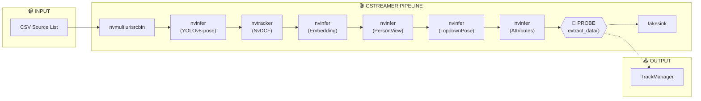

# DeepStream App: Clean Redesign Proposal

> **Mục đích**: Tài liệu đề xuất thiết kế lại ứng dụng DeepStream với code sạch hơn, loại bỏ boilerplate từ sample app NVIDIA, giữ nguyên chức năng và interface hiện tại.

---

## 1. Mục Tiêu Thiết Kế

### 1.1 Giữ Nguyên (Không Thay Đổi)

| Thành phần | Chi tiết |
|------------|----------|
| **Command line** | `./app -c config.yml` |
| **Config files** | `configs/deepstream/deepstream-app.yml` và các file liên quan |
| **Input** | CSV source list, RTSP streams, video files |
| **Output** | TrackManager nhận `TrackDataInQueue` để xử lý Re-ID, behavior analysis |
| **Pipeline logic** | Sources → Mux → PGIE → Tracker → SGIEs → TrackManager |

### 1.2 Cải Thiện

| Aspect | Old App | New App |
|--------|---------|---------|
| **Cấu trúc code** | 1825+ lines C, 1237+ lines C++ | ~500 lines C++ duy nhất |
| **Wrapper bins** | Dùng apps-common (phức tạp) | Dùng trực tiếp elements (đơn giản) |
| **NVIDIA boilerplate** | `write_kitti_*`, `process_meta`, etc. | Loại bỏ hoàn toàn |
| **Callback system** | 4 callbacks, 3 probes | 1 probe duy nhất |
| **Config parsing** | Separate C file | YAML-cpp trực tiếp |
| **Dependencies** | apps-common library | Minimal: GStreamer, DeepStream, YAML-cpp, OpenCV |

---

## 2. Pipeline Architecture Mới

### 2.1 Simplified Pipeline Diagram



### 2.2 Element Selection: Hai Cách Tiếp Cận

Có **2 cách** để khởi tạo và cấu hình elements/bins:

#### Option A: Direct Elements + Manual Config (Minimal Code)

| Component | Element | Config |
|-----------|---------|--------|
| **Source + Mux** | `nvmultiurisrcbin` | `g_object_set()` từ YAML::Node |
| **PGIE** | `nvinfer` | `g_object_set()` |
| **Tracker** | `nvtracker` | `g_object_set()` |
| **SGIEs** | 4× `nvinfer` | `g_object_set()` |
| **Sink** | `fakesink` | `g_object_set()` |

**Ưu điểm**: Code ngắn, dependencies ít
**Nhược điểm**: Tự parse YAML, không dùng được các tính năng của wrapper bin

#### Option B: YAML Parser + Wrapper Bins (Khuyên dùng - Chuẩn DeepStream)

| Component | Wrapper Bin / Parser | Create Function |
|-----------|---------------------|-----------------|
| **Source + Mux** | `nvmultiurisrcbin` (element) | `g_object_set()` + CSV parsing |
| **PGIE** | `NvDsPrimaryGieBin` | `parse_gie_yaml()` → `create_primary_gie_bin()` |
| **Tracker** | `NvDsTrackerBin` | `parse_tracker_yaml()` → `create_tracking_bin()` |
| **SGIEs** | `NvDsSecondaryGieBin` | `parse_gie_yaml()` → `create_secondary_gie_bin()` |
| **Sink** | `NvDsSinkBin` | `parse_sink_yaml()` → `create_sink_bin()` |
| **OSD** | `NvDsOSDBin` | `parse_osd_yaml()` → `create_osd_bin()` |

**Ưu điểm**: 
- Dùng được toàn bộ properties trong config YAML (không cần hardcode)
- Wrapper bins tự thêm queue, capsfilter cần thiết
- Standard NVIDIA approach, dễ maintain

**Nhược điểm**: Phải link apps-common library

> [!TIP]
> **Khuyến nghị**: Dùng **Option B** cho production vì chuẩn hơn. Option A chỉ dùng khi cần prototype nhanh hoặc muốn loại bỏ apps-common dependency.

---

### 2.3 Khi Nào Dùng Wrapper Bin?

| Trường hợp | Khuyên dùng |
|------------|-------------|
| Chỉ set vài properties | ❌ Direct element |
| Config file có nhiều properties | ✅ Wrapper bin + YAML parser |
| Cần queue/capsfilter tự động | ✅ Wrapper bin |
| Cần perf measurement | ✅ apps-common (có sẵn `enable_perf_measurement()`) |
| Muốn minimal dependencies | ❌ Direct element |

> [!NOTE]
> Không dùng **apps-common wrapper bins** (`NvDsSrcParentBin`, `NvDsPrimaryGieBin`, etc.) nếu muốn loại bỏ hoàn toàn apps-common. Nhưng nếu dùng thì sẽ tiện hơn.


---

## 3. Probe Specification

### 3.1 Chỉ Cần 1 Probe

| Probe | Gắn vào | Pad | Chức năng |
|-------|---------|-----|-----------|
| `extract_data_probe` | Sau SGIE cuối cùng | `src` | Extract all tensor outputs, gửi TrackManager |

**So sánh với app cũ:**

| Old App | New App |
|---------|---------|
| `gie_primary_processing_done_buf_prob` (sau PGIE) | ❌ Không cần |
| `analytics_done_buf_prob` (sau SGIEs) | ✅ `extract_data_probe` |
| `gie_processing_done_buf_prob` (trước OSD) | ❌ Không cần (không có OSD) |

### 3.2 Probe Input/Output

```
INPUT:
├── GstBuffer (chứa NvBufSurface)
└── NvDsBatchMeta (attached)
    └── frame_meta_list → NvDsFrameMeta
        └── obj_meta_list → NvDsObjectMeta
            ├── rect_params (bbox)
            ├── mask_params (keypoints từ PGIE pose)
            └── obj_user_meta_list → NvDsInferTensorMeta
                ├── unique_id = 2 → Embedding (512-dim)
                ├── unique_id = 3 → PersonView (3-class)
                ├── unique_id = 4 → TopdownPose (17 keypoints)
                └── unique_id = 5 → Attributes

OUTPUT:
└── TrackDataInQueue → TrackManager::update()
    ├── alive_objects: map<ClassId, vector<TrackingResult>>
    ├── frame: cv::Mat (RGB)
    ├── frame_number: FrameId
    ├── cam_id: CameraId
    └── current_time, buffer_time: int64_t
```

### 3.3 Reference Code Cũ

| Phần xử lý | Reference trong code cũ |
|------------|-------------------------|
| Lấy NvBufSurface | [deepstream_app_main.cpp:L129-144](file:///mnt/ssd2t/Users/laptq/fs_prj26_shoplifting_detection/src/deepstream/deepstream-app/deepstream_app_main.cpp#L129) `getNvBufSurface()` |
| Convert GPU→CPU | [deepstream_app_main.cpp:L100-127](file:///mnt/ssd2t/Users/laptq/fs_prj26_shoplifting_detection/src/deepstream/deepstream-app/deepstream_app_main.cpp#L100) `getCvMat()` |
| Extract keypoints | [deepstream_app_main.cpp:L208-303](file:///mnt/ssd2t/Users/laptq/fs_prj26_shoplifting_detection/src/deepstream/deepstream-app/deepstream_app_main.cpp#L208) mask_params parsing |
| Extract tensor SGIE | [deepstream_app_main.cpp:L324-393](file:///mnt/ssd2t/Users/laptq/fs_prj26_shoplifting_detection/src/deepstream/deepstream-app/deepstream_app_main.cpp#L324) obj_user_meta_list iteration |
| Build TrackingResult | [deepstream_app_main.cpp:L404-452](file:///mnt/ssd2t/Users/laptq/fs_prj26_shoplifting_detection/src/deepstream/deepstream-app/deepstream_app_main.cpp#L404) |
| Send to TrackManager | [deepstream_app_main.cpp:L455-468](file:///mnt/ssd2t/Users/laptq/fs_prj26_shoplifting_detection/src/deepstream/deepstream-app/deepstream_app_main.cpp#L455) |

---

## 4. Pseudo-Code Toàn Bộ Chương Trình

### 4.1 Option A: Direct Elements + Manual Config

```cpp
// File: main.cpp (~500 lines total)

#include <gst/gst.h>
#include <gstnvdsmeta.h>
#include <nvbufsurface.h>
#include <yaml-cpp/yaml.h>
#include <opencv2/core.hpp>
#include "modules/track_manager/track_manager.hpp"
#include "modules/datatemplates/data_templates.h"

//=============================================================================
// CONSTANTS
//=============================================================================
constexpr guint PGIE_UNIQUE_ID = 1;
constexpr guint SGIE_EMBEDDING_ID = 2;
constexpr guint SGIE_PERSONVIEW_ID = 3;
constexpr guint SGIE_POSE_ID = 4;
constexpr guint SGIE_ATTRIBUTES_ID = 5;

//=============================================================================
// GLOBAL STATE
//=============================================================================
struct AppContext {
    GstElement* pipeline;
    GMainLoop* loop;
    TrackManager* track_manager;
    std::vector<CameraConfig> cameras;  // From CSV
};

//=============================================================================
// UTILITY FUNCTIONS (copy from old app)
//=============================================================================

cv::Mat getCvMat(NvBufSurface* surface, guint batch_id);
// Reference: deepstream_app_main.cpp L100-127

NvBufSurface* getNvBufSurface(GstBuffer* buf);
// Reference: deepstream_app_main.cpp L129-144

//=============================================================================
// THE ONE AND ONLY PROBE
//=============================================================================

static GstPadProbeReturn extract_data_probe(
    GstPad* pad, 
    GstPadProbeInfo* info, 
    gpointer user_data
) {
    AppContext* ctx = (AppContext*)user_data;
    GstBuffer* buf = GST_PAD_PROBE_INFO_BUFFER(info);
    NvDsBatchMeta* batch_meta = gst_buffer_get_nvds_batch_meta(buf);
    if (!batch_meta) return GST_PAD_PROBE_OK;

    NvBufSurface* surface = getNvBufSurface(buf);

    // Iterate frames
    for (NvDsMetaList* l_frame = batch_meta->frame_meta_list; 
         l_frame; l_frame = l_frame->next) {
        
        NvDsFrameMeta* frame_meta = (NvDsFrameMeta*)l_frame->data;
        CameraId cam_id = ctx->cameras[frame_meta->source_id].camera_id;
        cv::Mat frame = getCvMat(surface, frame_meta->batch_id);
        
        std::unordered_map<ClassId, std::vector<TrackingResult>> alive_objects;

        // Iterate objects
        for (NvDsMetaList* l_obj = frame_meta->obj_meta_list;
             l_obj; l_obj = l_obj->next) {
            
            NvDsObjectMeta* obj = (NvDsObjectMeta*)l_obj->data;
            
            TrackingResult track;
            track.class_id = obj->class_id;
            track.track_id = std::to_string(cam_id) + "_" + std::to_string(obj->object_id);
            track.box = {obj->rect_params.left, obj->rect_params.top,
                         obj->rect_params.width, obj->rect_params.height};
            track.score = obj->confidence;
            track.camera_id = cam_id;

            // === 1. Extract keypoints from PGIE mask_params ===
            if (obj->mask_params.data != NULL) {
                // Reference: deepstream_app_main.cpp L208-303
                extract_keypoints_from_mask(obj, &track.keypoints, &track.keypoints_score);
            }

            // === 2. Extract tensor outputs from SGIEs ===
            for (NvDsMetaList* l_user = obj->obj_user_meta_list;
                 l_user; l_user = l_user->next) {
                
                NvDsUserMeta* user_meta = (NvDsUserMeta*)l_user->data;
                if (user_meta->base_meta.meta_type != NVDSINFER_TENSOR_OUTPUT_META) 
                    continue;
                
                NvDsInferTensorMeta* tensor = (NvDsInferTensorMeta*)user_meta->user_meta_data;
                
                switch (tensor->unique_id) {
                    case SGIE_EMBEDDING_ID:
                        // Reference: deepstream_app_main.cpp L333-342
                        extract_embedding(tensor, &track.embed_vec);
                        break;
                    case SGIE_PERSONVIEW_ID:
                        // Reference: deepstream_app_main.cpp L344-353
                        track.view_type = extract_personview(tensor);
                        break;
                    case SGIE_POSE_ID:
                        // Reference: deepstream_app_main.cpp L354-373
                        if (track.keypoints.empty()) {
                            extract_topdown_pose(tensor, &track.keypoints, &track.keypoints_score);
                        }
                        break;
                    case SGIE_ATTRIBUTES_ID:
                        // Reference: deepstream_app_main.cpp L374-390
                        track.attributes = extract_attributes(tensor);
                        break;
                }
            }

            // Skip if missing required data
            if (track.embed_vec.empty()) continue;

            alive_objects[track.class_id].push_back(std::move(track));
        }

        // === 3. Send to TrackManager ===
        TrackDataInQueue data;
        data.alive_objects = std::move(alive_objects);
        data.frame = std::move(frame);
        data.frame_number = frame_meta->frame_num;
        data.cam_id = cam_id;
        data.current_time = frame_meta->ntp_timestamp / 1000000;
        data.buffer_time = frame_meta->buf_pts / 1000000;
        
        ctx->track_manager->update(std::move(data));
    }

    return GST_PAD_PROBE_OK;
}

//=============================================================================
// PIPELINE CREATION
//=============================================================================

GstElement* create_pipeline(AppContext* ctx, const YAML::Node& config) {
    GstElement* pipeline = gst_pipeline_new("shoplifting-detection");
    
    // === 1. Create nvmultiurisrcbin ===
    // Reference: deepstream_app.c L1371-1400 (create_nvmultiurisrcbin_bin)
    GstElement* src = gst_element_factory_make("nvmultiurisrcbin", "src");
    g_object_set(G_OBJECT(src),
        "uri-list", build_uri_list(ctx->cameras),
        "max-batch-size", config["streammux"]["batch-size"].as<int>(),
        "width", config["streammux"]["width"].as<int>(),
        "height", config["streammux"]["height"].as<int>(),
        "batched-push-timeout", config["streammux"]["batched-push-timeout"].as<int>(),
        NULL);

    // === 2. Create PGIE ===
    // Reference: apps-common/src/deepstream_primary_gie.c
    GstElement* pgie = gst_element_factory_make("nvinfer", "pgie");
    g_object_set(G_OBJECT(pgie),
        "config-file-path", config["primary-gie"]["config-file"].as<std::string>().c_str(),
        "unique-id", PGIE_UNIQUE_ID,
        NULL);

    // === 3. Create Tracker ===
    // Reference: apps-common/src/deepstream_tracker.c
    GstElement* tracker = gst_element_factory_make("nvtracker", "tracker");
    g_object_set(G_OBJECT(tracker),
        "tracker-width", config["tracker"]["tracker-width"].as<int>(),
        "tracker-height", config["tracker"]["tracker-height"].as<int>(),
        "ll-lib-file", config["tracker"]["ll-lib-file"].as<std::string>().c_str(),
        "ll-config-file", config["tracker"]["ll-config-file"].as<std::string>().c_str(),
        NULL);

    // === 4. Create SGIEs ===
    GstElement* sgie_emb = create_sgie("sgie_embedding", 
        config["secondary-gie0"]["config-file"].as<std::string>(),
        SGIE_EMBEDDING_ID, PGIE_UNIQUE_ID);
    
    GstElement* sgie_view = create_sgie("sgie_personview",
        config["secondary-gie1"]["config-file"].as<std::string>(),
        SGIE_PERSONVIEW_ID, PGIE_UNIQUE_ID);
    
    GstElement* sgie_pose = nullptr;
    if (config["secondary-gie2"]["enable"].as<int>(0) == 1) {
        sgie_pose = create_sgie("sgie_pose",
            config["secondary-gie2"]["config-file"].as<std::string>(),
            SGIE_POSE_ID, PGIE_UNIQUE_ID);
    }
    
    GstElement* sgie_attr = nullptr;
    if (config["secondary-gie3"]["enable"].as<int>(0) == 1) {
        sgie_attr = create_sgie("sgie_attr",
            config["secondary-gie3"]["config-file"].as<std::string>(),
            SGIE_ATTRIBUTES_ID, PGIE_UNIQUE_ID);
    }

    // === 5. Create Sink ===
    GstElement* sink = gst_element_factory_make("fakesink", "sink");
    g_object_set(G_OBJECT(sink), "sync", FALSE, "async", FALSE, NULL);

    // === 6. Add all to pipeline ===
    gst_bin_add_many(GST_BIN(pipeline),
        src, pgie, tracker, sgie_emb, sgie_view, sink, NULL);
    if (sgie_pose) gst_bin_add(GST_BIN(pipeline), sgie_pose);
    if (sgie_attr) gst_bin_add(GST_BIN(pipeline), sgie_attr);

    // === 7. Link elements ===
    // nvmultiurisrcbin already includes streammux, output is "src" pad
    gst_element_link_many(src, pgie, tracker, sgie_emb, sgie_view, NULL);
    
    GstElement* last_sgie = sgie_view;
    if (sgie_pose) {
        gst_element_link(last_sgie, sgie_pose);
        last_sgie = sgie_pose;
    }
    if (sgie_attr) {
        gst_element_link(last_sgie, sgie_attr);
        last_sgie = sgie_attr;
    }
    gst_element_link(last_sgie, sink);

    // === 8. Add THE ONE PROBE ===
    GstPad* probe_pad = gst_element_get_static_pad(last_sgie, "src");
    gst_pad_add_probe(probe_pad, 
        GST_PAD_PROBE_TYPE_BUFFER,
        extract_data_probe, ctx, NULL);
    gst_object_unref(probe_pad);

    return pipeline;
}

//=============================================================================
// HELPER: Create SGIE
//=============================================================================

GstElement* create_sgie(const char* name, const std::string& config_file,
                        guint unique_id, guint operate_on_gie_id) {
    GstElement* sgie = gst_element_factory_make("nvinfer", name);
    g_object_set(G_OBJECT(sgie),
        "config-file-path", config_file.c_str(),
        "unique-id", unique_id,
        "process-mode", 2,  // Secondary mode
        NULL);
    return sgie;
}

//=============================================================================
// MAIN
//=============================================================================

int main(int argc, char* argv[]) {
    gst_init(&argc, &argv);
    
    // === 1. Parse args ===
    if (argc < 3 || strcmp(argv[1], "-c") != 0) {
        g_printerr("Usage: %s -c <config.yml>\n", argv[0]);
        return 1;
    }
    
    // === 2. Load config ===
    // Reference: deepstream_app_main.cpp L944-951
    YAML::Node app_config = YAML::LoadFile(argv[2]);
    std::string ds_config_path = app_config["DEEPSTREAM"]["config_path"].as<std::string>();
    YAML::Node config = YAML::LoadFile(ds_config_path);
    
    // === 3. Load cameras from CSV ===
    // Reference: deepstream_app_config_parser_yaml.cpp parse_source_yaml()
    AppContext ctx;
    ctx.cameras = parse_csv_sources(config["source"]["csv-file-path"].as<std::string>());
    
    // === 4. Create TrackManager ===
    // Reference: deepstream_app_main.cpp L978-981
    ctx.track_manager = new TrackManager(/* ... */);
    
    // === 5. Create pipeline ===
    ctx.pipeline = create_pipeline(&ctx, config);
    
    // === 6. Setup bus callback for errors/EOS ===
    GstBus* bus = gst_element_get_bus(ctx.pipeline);
    gst_bus_add_signal_watch(bus);
    g_signal_connect(bus, "message::error", G_CALLBACK(on_error), &ctx);
    g_signal_connect(bus, "message::eos", G_CALLBACK(on_eos), &ctx);
    gst_object_unref(bus);
    
    // === 7. Start pipeline ===
    gst_element_set_state(ctx.pipeline, GST_STATE_PLAYING);
    
    // === 8. Run main loop ===
    ctx.loop = g_main_loop_new(NULL, FALSE);
    
    // Ctrl+C handler
    signal(SIGINT, [](int) {
        g_main_loop_quit(/* need access to ctx.loop */);
    });
    
    g_main_loop_run(ctx.loop);
    
    // === 9. Cleanup ===
    gst_element_set_state(ctx.pipeline, GST_STATE_NULL);
    gst_object_unref(ctx.pipeline);
    delete ctx.track_manager;
    g_main_loop_unref(ctx.loop);
    
    return 0;
}
```

### 4.2 Option B: Dùng YAML Parser + Wrapper Bins

```cpp
// File: main.cpp (Option B - chuẩn DeepStream hơn)

#include <gst/gst.h>
#include <gstnvdsmeta.h>
#include <nvbufsurface.h>
#include <opencv2/core.hpp>

// DeepStream apps-common headers
#include "deepstream_config_yaml.h"      // parse_*_yaml() functions
#include "deepstream_primary_gie.h"      // create_primary_gie_bin()
#include "deepstream_secondary_gie.h"    // create_secondary_gie_bin()
#include "deepstream_tracker.h"          // create_tracking_bin()
#include "deepstream_osd.h"              // create_osd_bin()
#include "deepstream_sinks.h"            // create_sink_bin()

#include "modules/track_manager/track_manager.hpp"

//=============================================================================
// CONFIG STRUCTS (từ apps-common)
//=============================================================================
struct AppConfig {
    NvDsGieConfig pgie_config;
    NvDsGieConfig sgie_configs[MAX_SECONDARY_GIE_BINS];  // 4 SGIEs
    NvDsTrackerConfig tracker_config;
    NvDsOSDConfig osd_config;
    NvDsSinkSubBinConfig sink_config;
    NvDsStreammuxConfig streammux_config;
    
    // Wrapper bins
    NvDsPrimaryGieBin pgie_bin;
    NvDsSecondaryGieBin sgie_bin;
    NvDsTrackerBin tracker_bin;
    NvDsOSDBin osd_bin;
    NvDsSinkBin sink_bin;
};

struct AppContext {
    GstElement* pipeline;
    GMainLoop* loop;
    TrackManager* track_manager;
    std::vector<CameraConfig> cameras;
    AppConfig config;
};

//=============================================================================
// PARSE CONFIG: Dùng DeepStream YAML parsers
//=============================================================================

gboolean parse_config(AppConfig* config, gchar* cfg_file_path) {
    // Reference: deepstream_pipeline_howto.md Section 4.2 Cách 4
    // Reference: deepstream_config_yaml.h
    
    // 1. Parse PGIE config
    parse_gie_yaml(&config->pgie_config, "primary-gie", cfg_file_path);
    
    // 2. Parse Tracker config
    parse_tracker_yaml(&config->tracker_config, cfg_file_path);
    
    // 3. Parse SGIE configs
    parse_gie_yaml(&config->sgie_configs[0], "secondary-gie0", cfg_file_path);  // Embedding
    parse_gie_yaml(&config->sgie_configs[1], "secondary-gie1", cfg_file_path);  // PersonView
    parse_gie_yaml(&config->sgie_configs[2], "secondary-gie2", cfg_file_path);  // Pose
    parse_gie_yaml(&config->sgie_configs[3], "secondary-gie3", cfg_file_path);  // Attributes
    
    // 4. Parse OSD config (optional)
    parse_osd_yaml(&config->osd_config, cfg_file_path);
    
    // 5. Parse Sink config
    parse_sink_yaml(&config->sink_config, "sink0", cfg_file_path);
    
    // 6. Parse Streammux config
    parse_streammux_yaml(&config->streammux_config, cfg_file_path);
    
    return TRUE;
}

//=============================================================================
// PIPELINE CREATION: Dùng Wrapper Bins
//=============================================================================

GstElement* create_pipeline_option_b(AppContext* ctx, gchar* cfg_file_path) {
    GstElement* pipeline = gst_pipeline_new("shoplifting-detection");
    
    // === 1. Parse all configs ===
    parse_config(&ctx->config, cfg_file_path);
    
    // === 2. Create nvmultiurisrcbin (không có wrapper bin cho cái này) ===
    // Reference: deepstream_elements_hierarchy.md Section 4.1
    GstElement* src = gst_element_factory_make("nvmultiurisrcbin", "src");
    g_object_set(G_OBJECT(src),
        "uri-list", build_uri_list(ctx->cameras),
        "max-batch-size", ctx->config.streammux_config.batch_size,
        "width", ctx->config.streammux_config.pipeline_width,
        "height", ctx->config.streammux_config.pipeline_height,
        "batched-push-timeout", ctx->config.streammux_config.batched_push_timeout,
        NULL);
    
    // === 3. Create PGIE bin ===
    // Reference: apps-common/src/deepstream_primary_gie.c
    if (!create_primary_gie_bin(&ctx->config.pgie_config, &ctx->config.pgie_bin)) {
        g_printerr("Failed to create PGIE bin\n");
        return NULL;
    }
    
    // === 4. Create Tracker bin ===
    // Reference: apps-common/src/deepstream_tracker.c
    if (!create_tracking_bin(&ctx->config.tracker_config, &ctx->config.tracker_bin)) {
        g_printerr("Failed to create Tracker bin\n");
        return NULL;
    }
    
    // === 5. Create SGIE bin (chứa tất cả SGIEs) ===
    // Reference: apps-common/src/deepstream_secondary_gie.c
    guint num_sgies = 0;
    for (int i = 0; i < MAX_SECONDARY_GIE_BINS; i++) {
        if (ctx->config.sgie_configs[i].enable) num_sgies++;
    }
    if (num_sgies > 0) {
        if (!create_secondary_gie_bin(num_sgies, 1, 
                ctx->config.sgie_configs, &ctx->config.sgie_bin)) {
            g_printerr("Failed to create SGIE bin\n");
            return NULL;
        }
    }
    
    // === 6. Create Sink bin ===
    // Reference: apps-common/src/deepstream_sinks.c
    NvDsSinkSubBinConfig sink_configs[1] = {ctx->config.sink_config};
    if (!create_sink_bin(1, sink_configs, &ctx->config.sink_bin, 0)) {
        g_printerr("Failed to create Sink bin\n");
        return NULL;
    }
    
    // === 7. Add wrapper bins to pipeline ===
    // Wrapper bins có property .bin là GstElement* thực tế
    gst_bin_add_many(GST_BIN(pipeline),
        src,
        ctx->config.pgie_bin.bin,
        ctx->config.tracker_bin.bin,
        ctx->config.sgie_bin.bin,
        ctx->config.sink_bin.bin,
        NULL);
    
    // === 8. Link elements ===
    gst_element_link_many(
        src,
        ctx->config.pgie_bin.bin,
        ctx->config.tracker_bin.bin,
        ctx->config.sgie_bin.bin,
        ctx->config.sink_bin.bin,
        NULL);
    
    // === 9. Add probe trên src pad của SGIE bin ===
    GstPad* probe_pad = gst_element_get_static_pad(ctx->config.sgie_bin.bin, "src");
    gst_pad_add_probe(probe_pad, 
        GST_PAD_PROBE_TYPE_BUFFER,
        extract_data_probe, ctx, NULL);
    gst_object_unref(probe_pad);
    
    return pipeline;
}

//=============================================================================
// MAIN (Option B)
//=============================================================================

int main(int argc, char* argv[]) {
    gst_init(&argc, &argv);
    
    if (argc < 3 || strcmp(argv[1], "-c") != 0) {
        g_printerr("Usage: %s -c <config.yml>\n", argv[0]);
        return 1;
    }
    
    // Load app config để lấy đường dẫn deepstream config
    YAML::Node app_config = YAML::LoadFile(argv[2]);
    std::string ds_config_path = app_config["DEEPSTREAM"]["config_path"].as<std::string>();
    gchar* cfg_file_path = g_strdup(ds_config_path.c_str());
    
    AppContext ctx = {0};
    
    // Parse CSV sources
    // Reference: deepstream_app_config_parser_yaml.cpp parse_source_yaml()
    ctx.cameras = parse_csv_sources(/* get from config */);
    
    // Create TrackManager
    ctx.track_manager = new TrackManager(/* ... */);
    
    // Create pipeline using Option B
    ctx.pipeline = create_pipeline_option_b(&ctx, cfg_file_path);
    
    // Setup bus, main loop, cleanup... (giống Option A)
    // ...
    
    g_free(cfg_file_path);
    return 0;
}
```

**So sánh Option A vs Option B:**

| Aspect | Option A | Option B |
|--------|----------|----------|
| **Config parsing** | YAML::Node + manual extraction | `parse_*_yaml()` functions |
| **Element creation** | `gst_element_factory_make()` + `g_object_set()` | `create_*_bin()` functions |
| **Dependencies** | yaml-cpp | apps-common library |
| **Lines of code** | ~400 | ~350 |
| **Flexibility** | High (custom logic) | Medium (follow NVIDIA patterns) |
| **Maintainability** | Need to update when config changes | Auto-handle new config keys |

---

## 5. File Structure Mới

```
src/deepstream/
├── main.cpp                    # ~300 lines - Pipeline creation + main()
├── probe.cpp                   # ~150 lines - extract_data_probe()
├── utils.cpp                   # ~50 lines - getCvMat(), getNvBufSurface()
├── config_parser.cpp           # ~50 lines - YAML parsing helpers
└── CMakeLists.txt              # Build config
```

**So sánh với app cũ:**

```
OLD (4000+ lines):                NEW (~500 lines):
├── deepstream_app_main.cpp      └── main.cpp        (all-in-one)
├── deepstream_app.c                 ├── probe.cpp   (optional split)
├── deepstream_app_config_parser.c   ├── utils.cpp   (optional split)
├── deepstream_app_config_parser_yaml.cpp
└── + apps-common library (~20 files)
```

---

## 6. Các Lưu Ý Quan Trọng

### 6.1 nvmultiurisrcbin vs nvstreammux

> [!IMPORTANT]
> `nvmultiurisrcbin` **đã bao gồm** `nvstreammux` bên trong. Không cần tạo muxer riêng.

```cpp
// SAI: Tạo muxer riêng
GstElement* mux = gst_element_factory_make("nvstreammux", "mux");
gst_element_link(src, mux);  // ERROR: nvmultiurisrcbin output is already muxed

// ĐÚNG: Link trực tiếp vào PGIE
gst_element_link(src, pgie);  // nvmultiurisrcbin outputs batched frames
```

Xem thêm: [deepstream_elements_hierarchy.md - Section 4.1](file:///mnt/ssd2t/Users/laptq/fs_prj26_shoplifting_detection/drafts/deepstream_elements_hierarchy.md#L237)

### 6.2 SGIE Unique IDs

Các `unique_id` phải khớp giữa config YAML và code constants:

| Config file | Key | Must match |
|-------------|-----|------------|
| `deepstream-app.yml` | `secondary-gieN.gie-unique-id` | Code constants |
| `sgie/embedding.yml` | `gie-unique-id` | `SGIE_EMBEDDING_ID = 2` |
| `sgie/personview.yml` | `gie-unique-id` | `SGIE_PERSONVIEW_ID = 3` |

### 6.3 Tensor Data Location

Tensor outputs có thể nằm trên **GPU hoặc CPU**, phải kiểm tra:

```cpp
// Reference: deepstream_app_main.cpp L335-338
if (tensor_meta->out_buf_ptrs_dev[i]) {
    // Data on GPU - copy to CPU first
    cudaMemcpy(tensor_meta->out_buf_ptrs_host[i],
               tensor_meta->out_buf_ptrs_dev[i],
               info->inferDims.numElements * sizeof(float),
               cudaMemcpyDeviceToHost);
}
float* data = (float*)tensor_meta->out_buf_ptrs_host[i];
```

### 6.4 Memory Management

| Object | Allocation | Deallocation |
|--------|------------|--------------|
| `TrackingResult` | Stack/move | Auto |
| `TrackDataInQueue` | Move semantics | TrackManager owns |
| `NvDsDisplayMeta` | Pool | Auto-release |
| `cv::Mat` | Move into TrackDataInQueue | TrackManager owns |

---

## 7. Optional: OSD Support

Nếu cần enable OSD cho debugging:

```cpp
// Thêm OSD vào pipeline
if (config["osd"]["enable"].as<int>(0) == 1) {
    GstElement* osd = gst_element_factory_make("nvdsosd", "osd");
    g_object_set(G_OBJECT(osd),
        "display-bbox", TRUE,
        "display-text", TRUE,
        NULL);
    
    // Insert between last_sgie and sink
    gst_bin_add(GST_BIN(pipeline), osd);
    gst_element_link_many(last_sgie, osd, sink, NULL);
    
    // Move probe to after OSD if OSD enabled
    probe_pad = gst_element_get_static_pad(osd, "src");
}
```

---

## 8. Build System

### 8.1 CMakeLists.txt

```cmake
cmake_minimum_required(VERSION 3.18)
project(deepstream-clean-app LANGUAGES CXX CUDA)

set(CMAKE_CXX_STANDARD 17)

# DeepStream SDK
set(DEEPSTREAM_DIR "/opt/nvidia/deepstream/deepstream")
include_directories(${DEEPSTREAM_DIR}/sources/includes)
link_directories(${DEEPSTREAM_DIR}/lib)

# GStreamer
find_package(PkgConfig REQUIRED)
pkg_check_modules(GST REQUIRED gstreamer-1.0 gstreamer-video-1.0)

# OpenCV
find_package(OpenCV REQUIRED)

# YAML-cpp
find_package(yaml-cpp REQUIRED)

# CUDA
find_package(CUDA REQUIRED)

add_executable(deepstream-clean-app
    main.cpp
    # probe.cpp utils.cpp config_parser.cpp  # if split
)

target_include_directories(deepstream-clean-app PRIVATE
    ${GST_INCLUDE_DIRS}
    ${OpenCV_INCLUDE_DIRS}
    ${CUDA_INCLUDE_DIRS}
    ${CMAKE_SOURCE_DIR}/../../modules   # TrackManager, etc.
)

target_link_libraries(deepstream-clean-app
    ${GST_LIBRARIES}
    ${OpenCV_LIBS}
    ${CUDA_LIBRARIES}
    yaml-cpp
    nvds_meta
    nvdsgst_meta
    nvbufsurface
    cudart
)
```

---

## 9. Reference Links

### 9.1 Code Cũ Cần Tham Khảo

| Chức năng | File | Lines | Link |
|-----------|------|-------|------|
| **getCvMat()** | deepstream_app_main.cpp | 100-127 | [Link](file:///mnt/ssd2t/Users/laptq/fs_prj26_shoplifting_detection/src/deepstream/deepstream-app/deepstream_app_main.cpp#L100) |
| **getNvBufSurface()** | deepstream_app_main.cpp | 129-144 | [Link](file:///mnt/ssd2t/Users/laptq/fs_prj26_shoplifting_detection/src/deepstream/deepstream-app/deepstream_app_main.cpp#L129) |
| **Keypoint extraction** | deepstream_app_main.cpp | 208-303 | [Link](file:///mnt/ssd2t/Users/laptq/fs_prj26_shoplifting_detection/src/deepstream/deepstream-app/deepstream_app_main.cpp#L208) |
| **SGIE tensor extraction** | deepstream_app_main.cpp | 324-393 | [Link](file:///mnt/ssd2t/Users/laptq/fs_prj26_shoplifting_detection/src/deepstream/deepstream-app/deepstream_app_main.cpp#L324) |
| **TrackingResult build** | deepstream_app_main.cpp | 404-452 | [Link](file:///mnt/ssd2t/Users/laptq/fs_prj26_shoplifting_detection/src/deepstream/deepstream-app/deepstream_app_main.cpp#L404) |
| **TrackManager::update()** | deepstream_app_main.cpp | 468 | [Link](file:///mnt/ssd2t/Users/laptq/fs_prj26_shoplifting_detection/src/deepstream/deepstream-app/deepstream_app_main.cpp#L468) |
| **CSV parsing** | deepstream_app_config_parser_yaml.cpp | - | [File](file:///mnt/ssd2t/Users/laptq/fs_prj26_shoplifting_detection/src/deepstream/deepstream-app/deepstream_app_config_parser_yaml.cpp) |

### 9.2 Documentation Reference

| Doc | Link |
|-----|------|
| Elements Hierarchy | [deepstream_elements_hierarchy.md](file:///mnt/ssd2t/Users/laptq/fs_prj26_shoplifting_detection/drafts/deepstream_elements_hierarchy.md) |
| Pipeline How-To | [deepstream_pipeline_howto.md](file:///mnt/ssd2t/Users/laptq/fs_prj26_shoplifting_detection/drafts/deepstream_pipeline_howto.md) |
| Pipeline Intervention | [deepstream_pipeline_intervention.md](file:///mnt/ssd2t/Users/laptq/fs_prj26_shoplifting_detection/drafts/deepstream_pipeline_intervention.md) |
| Current Architecture | [deepstream_app_architecture.md](file:///mnt/ssd2t/Users/laptq/fs_prj26_shoplifting_detection/drafts/deepstream_app_architecture.md) |

---

## 10. Implementation Checklist

- [ ] **Phase 1: Skeleton**
  - [ ] Create `main.cpp` with minimal pipeline (src → sink)
  - [ ] Verify builds and runs
  
- [ ] **Phase 2: Add Inference**
  - [ ] Add PGIE, verify detections via simple probe
  - [ ] Add Tracker
  - [ ] Add SGIEs one by one
  
- [ ] **Phase 3: Probe Integration**
  - [ ] Copy `getCvMat()`, `getNvBufSurface()` from old code
  - [ ] Implement `extract_data_probe()`
  - [ ] Test tensor extraction for each SGIE
  
- [ ] **Phase 4: TrackManager**
  - [ ] Copy `TrackDataInQueue`, `TrackingResult` structs
  - [ ] Integrate TrackManager
  - [ ] Verify end-to-end output
  
- [ ] **Phase 5: Config Compatibility**
  - [ ] Ensure same config files work
  - [ ] Same command line interface
