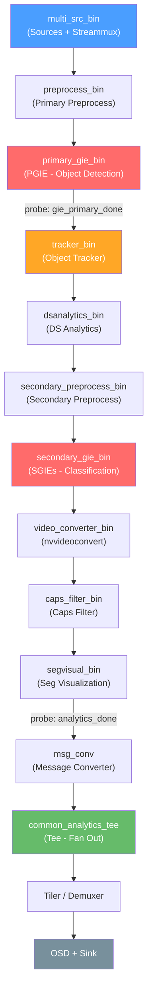

# Phân tích chi tiết hàm [create_common_elements](file:///mnt/ssd2t/Users/laptq/fs_prj26_shoplifting_detection/src/deepstream/deepstream-app/deepstream_app.c#1083-1292)

## Tổng quan

Hàm [create_common_elements](file:///mnt/ssd2t/Users/laptq/fs_prj26_shoplifting_detection/src/deepstream/deepstream-app/deepstream_app.c#L1088-L1291) tạo ra **chuỗi các GStreamer element dùng chung** cho toàn bộ pipeline DeepStream. "Dùng chung" có nghĩa là các element này xử lý **batched data** (dữ liệu đã gộp từ tất cả source), nên chỉ cần 1 instance duy nhất, bất kể có bao nhiêu camera/source đầu vào.

> [!IMPORTANT]
> Hàm này xây dựng chuỗi element theo thứ tự **từ downstream lên upstream** (từ cuối pipeline lên đầu pipeline), sử dụng 2 con trỏ `sink_elem` và `src_elem` để theo dõi 2 đầu của chuỗi đã xây.

## Cơ chế xây dựng chuỗi (Reverse-Chaining Pattern)

Hàm sử dụng 2 con trỏ output:
- `*sink_elem`: **element cuối** (downstream nhất) của chuỗi — nơi dữ liệu **đi vào** chuỗi common
- `*src_elem`: **element đầu** (upstream nhất) của chuỗi — nơi dữ liệu **đi ra** khỏi chuỗi common

Mỗi khi thêm 1 element mới, code thực hiện 3 bước:
1. Nếu `*src_elem` chưa có → gán element mới làm `*src_elem` (element đầu tiên được tạo sẽ là đầu ra cuối cùng)
2. Nếu `*sink_elem` đã có → link element mới **vào phía upstream** của `*sink_elem` (tức `NVGSTDS_LINK_ELEMENT(new, *sink_elem)` = new.src → sink_elem.sink)
3. Cập nhật `*sink_elem` = element mới (element mới giờ là đầu vào của chuỗi)

> [!NOTE]
> `NVGSTDS_LINK_ELEMENT(A, B)` gọi `gst_element_link(A, B)`, tức nối **src pad của A** với **sink pad của B**.
> Nên `NVGSTDS_LINK_ELEMENT(new_elem, *sink_elem)` nghĩa là: data sẽ chảy `new_elem → *sink_elem`.

## Thứ tự tạo element và luồng data

Các element được tạo theo thứ tự **ngược dòng** (downstream trước, upstream sau). Khi nối xong, luồng data chảy **theo chiều ngược lại** (upstream → downstream).

### Thứ tự tạo (trong code, từ trên xuống dưới):

| # | Block điều kiện | Element | Vai trò |
|---|---|---|---|
| 1 | `segvisual_config.enable` | `segvisual_bin` | Hiển thị kết quả segmentation |
| 2 | `true` (luôn tạo) | `caps_filter_bin` | Giới hạn/chuyển đổi format caps |
| 3 | `true` (luôn tạo) | `video_converter_bin` | Chuyển đổi format video (nvvideoconvert) |
| 4 | `primary_gie + num_secondary_gie > 0` | `secondary_gie_bin` | Các SGIE (nhận diện thuộc tính đối tượng) |
| 5 | `primary_gie + num_secondary_preprocess > 0` | `secondary_preprocess_bin` | Tiền xử lý cho SGIE (crop ROI, tensor prep) |
| 6 | `dsanalytics_config.enable` | `dsanalytics_bin` | NV DS Analytics (đếm, hướng di chuyển…) |
| 7 | `tracker_config.enable` | `tracker_bin` | Object tracker (NvDCF, DeepSORT…) |
| 8 | `primary_gie_config.enable` | `primary_gie_bin` | PGIE (Primary GIE — phát hiện đối tượng) |
| 9 | `preprocess_config.enable` | `preprocess_bin` | Tiền xử lý cho PGIE (primary preprocess) |

### Thứ tự chạy thực tế (data flow):

Vì tạo ngược, nên khi đã link xong, data chảy theo chiều **ngược với thứ tự tạo**:

```
Data flow (upstream → downstream):

preprocess_bin (9)
    ↓
primary_gie_bin (8)  ← Có probe "src" pad: gie_primary_processing_done_buf_prob
    ↓
tracker_bin (7)
    ↓
dsanalytics_bin (6)
    ↓
secondary_preprocess_bin (5)
    ↓
secondary_gie_bin (4)
    ↓
video_converter_bin (3)
    ↓
caps_filter_bin (2)
    ↓
segvisual_bin (1)
    ↓
[probe "src" trên src_elem: analytics_done_buf_prob]
    ↓
msg_conv (nếu enable) → tee ("common_analytics_tee")
    ↓
[→ tiler/demuxer → processing_instances (OSD + Sink)]
```

> [!WARNING]
> Element nào **không enable** sẽ bị bỏ qua hoàn toàn. Ví dụ nếu không có tracker, data sẽ chảy thẳng từ PGIE → DSAnalytics (hoặc SGIE nếu cũng không có DSAnalytics).

## Phần cuối: Probe + Message Converter + Tee

Sau khi chuỗi chính được xây xong (lines 1252-1286):

1. **Probe [analytics_done_buf_prob](file:///mnt/ssd2t/Users/laptq/fs_prj26_shoplifting_detection/src/deepstream/deepstream-app/deepstream_app.c#864-892)** gắn trên src pad của `*src_elem` (element cuối downstream nhất) — callback này xử lý output metadata sau khi tất cả inference đã chạy xong
2. **Message Converter** (`msg_conv`): nếu enable, tạo element chuyển đổi metadata → payload message, link sau `*src_elem`, cập nhật `*src_elem`
3. **Tee** (`common_analytics_tee`): luôn được tạo, link sau msg_conv (hoặc element cuối), để fan-out dữ liệu ra nhiều nhánh (tiler, broker sink, v.v.)

## Cách hàm caller sử dụng kết quả

Trong [create_pipeline](file:///mnt/ssd2t/Users/laptq/fs_prj26_shoplifting_detection/src/deepstream/deepstream-app/deepstream_app.c#L1604-L1617):

```c
create_common_elements(config, pipeline, &tmp_elem1, &tmp_elem2, ...);
//   tmp_elem1 = sink_elem → đầu vào chuỗi (upstream nhất, vd: preprocess_bin)
//   tmp_elem2 = src_elem  → đầu ra chuỗi (downstream nhất = tee)

// Link src_elem (tee) vào last_elem (tiler/demuxer)
NVGSTDS_LINK_ELEMENT(tmp_elem2, last_elem);
// Cập nhật last_elem = sink_elem (đầu vào chuỗi common)
last_elem = tmp_elem1;
// Nối multi_src_bin vào đầu vào chuỗi common
NVGSTDS_LINK_ELEMENT(pipeline->multi_src_bin.bin, last_elem);
```

Tức luồng tổng thể:
```
multi_src_bin → [sink_elem ... src_elem] → tiler/demuxer → OSD → Sink
                 ^^^^^^^^^^^^^^^^^^^^^^^^
                 Chuỗi common_elements
```

## Sơ đồ toàn cảnh



> [!TIP]
> Các element có nền đỏ là inference (PGIE/SGIE), cam là tracker, xanh là tee (fan-out). Mỗi element có thể bị bỏ qua nếu disable trong config.
