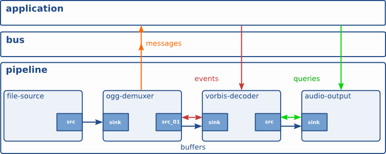

# GStreamer là gì?

- Kiến trúc các "plugin".
- Các plugin được liên kết với nhau.

## Các khái niệm cơ bản (Foundation)

* ***Elements***:
    * Tự viết element mới: Tham khảo *GStreamer Plugin Writer's Guide*.
* ***Pads (Cổng giao tiếp)***:
    * Các "cổng" (port) của element, dùng để kết nối và truyền dữ liệu giữa các element.
    * Hai pad chỉ cho phép kết nối nếu các kiểu dữ liệu chúng hỗ trợ (capabilities) tương thích với nhau.
    * Dữ liệu truyền qua các pad gồm: ***buffers*** (`GstBuffer`), ***events*** (`GstEvent`), ***queries*** (`GstQuery`).
* ***Bins*** và ***Pipelines***:
    * Bin:
        * Là một element (subclass)
        * Dùng để chứa các element khác. 
        * Ta có thể thay đổi trạng thái của toàn bộ element trong bin bằng cách thay đổi trạng thái của chính bin đó.
    * Pipeline:
        * Là một bin ở cấp độ cao nhất (top-level). 
        * Nó cung cấp một bus cho ứng dụng.
        * Khi được chạy (started), pipeline sẽ chạy trong một thread riêng biệt.
* ***Giao tiếp***:
    * ***Buffers***: dữ liệu luân chuyển giữa các element. Luôn đi từ source -> sink.
    * ***Events***: các sự kiện truyền giữa các element, hoặc từ ứng dụng xuống element.
    * ***Messages***: các thông báo do element gửi cho ứng dụng thông qua bus của pipeline.
    * ***Queries***: cho phép ứng dụng truy vấn thông tin, hoặc cho phép element truy vấn thông tin từ các element khác.

## Nguyên lý thiết kế

- **Hướng đối tượng (Object oriented)**: GStreamer tuân theo mô hình object `GObject` (`GLib 2.0`). GStreamer có phong cách lập trình tương tự như `GTK+`.
- **Dễ mở rộng (Extensible)**: Tất cả object trong GStreamer đều có thể được mở rộng thông qua cơ chế kế thừa của `GObject`.
- **Hỗ trợ plugin dạng nhị phân (Allow binary-only plugins)**.

## Các gói GStreamer (packages)

- gstreamer: gói cốt lõi
- gst-plugins-base: tập hợp các element cơ bản, thiết yếu
- gst-plugins-good: các plugin chất lượng cao (giấy phép LGPL)
- gst-plugins-ugly: các plugin chất lượng tốt nhưng có thể vướng mắc về bản quyền/phân phối
- gst-plugins-bad: các plugin cần được hoàn thiện thêm về chất lượng
- gst-libav: đóng gói bộ thư viện libav dùng để encode và decode
- Một vài gói khác

## References

1. https://gstreamer.freedesktop.org/documentation/application-development/introduction/gstreamer.html?gi-language=python
2. https://gstreamer.freedesktop.org/documentation/application-development/introduction/motivation.html?gi-language=python
3. https://gstreamer.freedesktop.org/documentation/application-development/introduction/basics.html?gi-language=python
